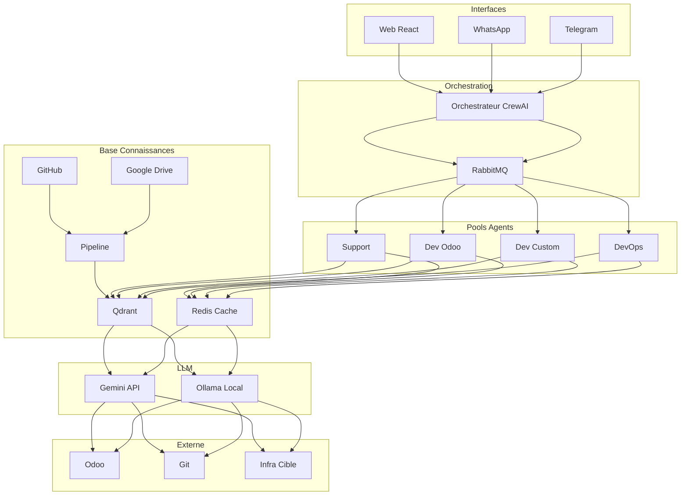

# GEMINI.md – Écosystème d'Agents IA pour Opérations ITS (Version Compressée)

## 📋 Table des Matières
View file: @file:docs/dev/GEMINI_TECH_DEFS.md

0. [Table des Matières](#0-table-des-matières)
1. [📋 Vue d'Ensemble du Projet](#1--vue-densemble-du-projet)
2. [🛠 Stack Technologique](#2--stack-technologique)
3. [🏗 Architecture & Design Patterns](#3--architecture--design-patterns)
4. [🎨 Charte Graphique et Design System](#4--charte-graphique-et-design-system)
5. [📱 Spécifications Frontend Détaillées](#5--spécifications-frontend-détaillées)
6. [⚙️ Spécifications Backend Détaillées](#6-️-spécifications-backend-détaillées)
7. [📲 Spécifications Mobile Détaillées](#7--spécifications-mobile-détaillées)
8. [🧪 Stratégie de Test](#8--stratégie-de-test)
9. [🌿 Workflow Git](#9--workflow-git)
10. [🚀 Déploiement & CI/CD](#10--déploiement--cicd)
11. [📚 Guide de Documentation](#11--guide-de-documentation)
12. [📐 Standards de Codage](#12--standards-de-codage)
13. [🔧 Configuration de l'Environnement](#13--configuration-de-lenvironnement)
14. [🔒 Sécurité & Conformité](#14--sécurité--conformité)
15. [🎯 Configuration Productivité IA](#15--configuration-productivité-ia)
16. [🤖 Instructions Spécifiques à Gemini](#16--instructions-spécifiques-à-gemini)
17. [📊 Définition des Agents](#17--définition-des-agents)
18. [🔄 Flux d'Interaction](#18--flux-dinteraction)
19. [📈 Phases de Développement](#19--phases-de-développement)
20. [✅ Règles et Contraintes](#20--règles-et-contraintes)
21. [📝 Historique des Révisions](#21--historique-des-révisions)

## 📋 Vue d'Ensemble
Système multi-agents IA assistant équipe ITS (support, dev, DevOps, direction) sur Odoo et développements externes.

**Public**: Support N1-3, Développeurs, DevOps, Direction, Clients (limité)

**Valeurs**: Automatisation intelligente, Augmentation humaine, Sécurité by design, ROI mesurable

---

## 🛠 Stack Technologique

| Composant | Technologie |
|-----------|-------------|
| **Backend** | Python 3.11+, FastAPI |
| **Frontend** | TypeScript, React 18, TailwindCSS |
| **Mobile** | Flutter 3.x |
| **Agents** | CrewAI/AutoGen, LangGraph |
| **LLM** | Gemini 1.5 Pro/Flash, Ollama (local) |
| **Base Connaissances** | Qdrant (vector DB), GitHub, Google Drive |
| **Base données** | PostgreSQL 15+, Redis 7+ |
| **Queue** | RabbitMQ |
| **Infra** | Docker, K8s (opt), GitHub Actions |

---

## 🏗 Architecture



**Patterns**: Microservices, Event-Driven, CQRS, Repository, Factory, Strategy

---

## 🎨 Charte Graphique

```css
:root {
  --primary-500: #1a5cff;  /* Bleu principal */
  --success-500: #10b981;  /* Vert */
  --warning-500: #f59e0b;  /* Orange */
  --error-500: #ef4444;    /* Rouge */
  --info-500: #3b82f6;     /* Bleu info */
  
  --gradient-support: linear-gradient(135deg, #667eea, #764ba2);
  --gradient-dev: linear-gradient(135deg, #f093fb, #f5576c);
  --gradient-devops: linear-gradient(135deg, #4facfe, #00f2fe);
  
  --font-primary: 'Inter', sans-serif;
  --font-mono: 'JetBrains Mono', monospace;
}
```

**Pages principales**: Dashboard, Chat Console, Projets, Artefacts, Configuration Agents, Users, Logs, Métriques

**Composants clés**: Sidebar, AgentCard, MetricCard, ChatConsole, LogEntry, StatusBadge

---

## ⚙️ API Endpoints Principaux

```
Auth:     POST   /auth/{login,logout}  GET /auth/me
Chat:     POST   /orchestrator/chat     GET /orchestrator/status
Agents:   GET    /agents                GET /agents/:id/metrics
          POST   /agents/:id/execute    PUT /agents/:id/config
Tasks:    GET    /tasks                  POST /tasks
          GET    /tasks/:id/result       PUT /tasks/:id/cancel
Artifacts: GET   /artifacts              POST /artifacts
```

---

## 📱 Mobile (Flutter)

**2 apps**:
1. **ITS Agent Companion** (interne): Notifications, approbations, métriques, chat
2. **ITS Client Support** (WhatsApp/Telegram first): Support N1, statut tickets, FAQ

---

## 🧪 Tests

| Type | Technologie | Couverture |
|------|-------------|------------|
| Unitaires | pytest, Jest, flutter_test | 80% |
| Intégration | pytest + TestContainers | 70% |
| E2E | Playwright, Patrol | 50% flows |
| Agents | Évaluation prompts | - |
| Performance | locust, k6 | Seuils définis |

---

## 🌿 Git Workflow

**Branches**: `main` ← `develop` ← `feature/*` / `bugfix/*` / `release/*` / `hotfix/*`

**Commits**: `type(scope): description` (feat/fix/docs/style/refactor/test/chore/agent)

**PR**: Template obligatoire + 1 approbation + tests passent

---

## 🚀 CI/CD (GitHub Actions)

**Environnements**: dev (dev.agents.its.sn) → staging → prod (agents.its.sn)

**Pipeline**: `test` → `build` → `deploy-staging` (develop) → `deploy-prod` (main, manuel)

---

## 🔒 Sécurité

**Principes**: Moindre privilège, défense profonde, traçabilité, validation humaine

**Classification données**:
- Public: Documentation
- Interne: Métriques agrégées (chiffré)
- Confidentiel: Données clients (chiffré, accès restreint)
- Très sensible: Credentials (jamais envoyé à LLM externe)

**Actions critiques** (validation humaine requise): Désactivation comptes, déploiement prod, modif données financières, suppression données

---

## 🤖 Agents IA

### Pôle Support & Admin Odoo
| Agent | Rôle | Modèle |
|-------|------|--------|
| **Monitoring** | Surveille infra, détecte anomalies | flash |
| **Sécurité** | Audit quotidien comptes, droits | pro |
| **Support N1** | FAQ, catégorisation tickets | flash |
| **Reporting** | Rapports mensuels automatiques | pro |

### Pôle Développement Odoo
| Agent | Rôle | Modèle |
|-------|------|--------|
| **Backend Odoo** | Modules Python, modèles, API | pro |
| **Frontend Odoo** | Vues XML, JS (Owl), thèmes | flash |
| **Mobile Odoo** | Apps Flutter/RN connectées | pro |
| **Intégration/API** | Connecteurs tiers | pro |

### Pôle Développement Custom
| Agent | Rôle | Modèle |
|-------|------|--------|
| **Backend Custom** | API (Node.js, Python, PHP) | pro |
| **Frontend Custom** | Sites/web apps (React, Vue) | flash |
| **Mobile Custom** | Apps natives/hybrides | pro |
| **DevOps** | Infra, déploiements, CI/CD | pro |

### Orchestrateur Principal
Reçoit demandes, décompose, assigne, suit, restitue (Gemini pro)

---

## 🔄 Flux Exemple (Manager WhatsApp)

1. Manager → WhatsApp: "App mobile devis, délai?"
2. WhatsApp → Orchestrateur
3. Orchestrateur décompose: Backend Odoo (5j) + Mobile Odoo (7j)
4. Synthèse: 12j → WhatsApp → Manager
5. Manager: "Lancez" → Création projet Jira + assignation agents
6. Agents développent → PR → URL staging
7. Notification Manager: "Projet prêt: https://..."

---

## 📈 Phases Développement

| Phase | Sprints | Objectifs |
|-------|---------|-----------|
| **1: Fondations** | 1-4 | Infra, Gemini, Monitoring, Support N1 |
| **1.5: Base Connaissances** | 2-6 | GitHub/Drive/Qdrant, ingestion |
| **2: Dev Odoo** | 5-8 | Agents backend/frontend, Web v1, Git |
| **3: Messaging** | 9-12 | WhatsApp, Telegram, Sécurité, Reporting |
| **4: Dev Custom** | 13-16 | Agents backend/frontend/mobile custom |
| **5: Maturité** | 17-20 | DevOps, optimisation, dashboard direction |

---

## ✅ Règles Clés

1. **Toujours** inclure gestion d'erreurs + docstrings
2. **Jamais** de secrets dans logs/réponses
3. **Tester** avant déploiement (staging first)
4. **Actions critiques** → validation humaine
5. **Documenter** modifications prompts

**Checklist pré-commit**: Code doc, tests, lint, secrets, version, changelog, review

---

## 📝 Historique Récent

| Date | Version | Changement |
|------|---------|------------|
| 20/04/2025 | 2.0.0 | Version finale board |
| 15/04/2025 | 1.5.0 | Migration Gemini 1.5 Pro |
| 10/04/2025 | 1.4.0 | Validation humaine workflow |
| 01/04/2025 | 1.3.0 | Métriques ROI |

---

**Note**: Ce document est activement maintenu. Mettre à jour section 15 (Productivité IA) face à erreurs répétées.