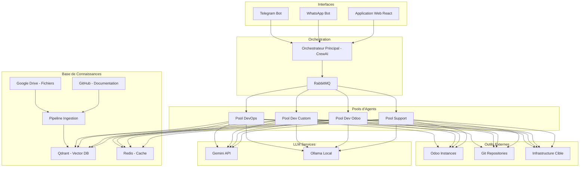
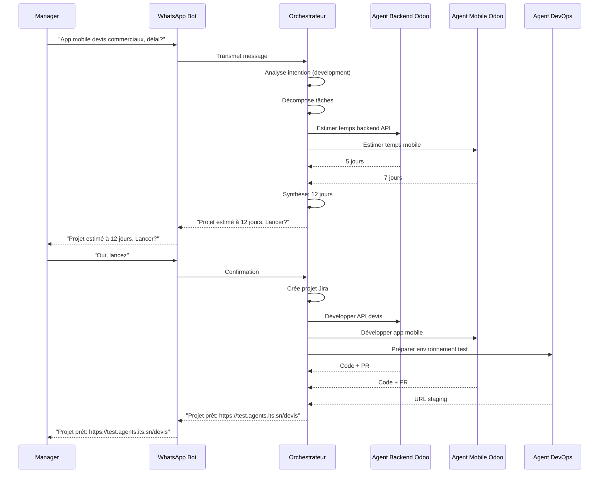
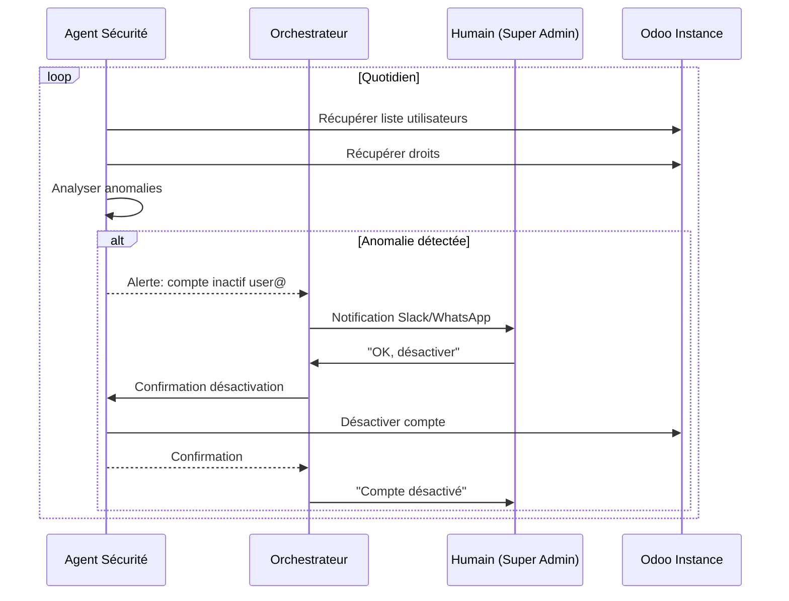

# GEMINI.md – Écosystème d'Agents IA pour les Opérations ITS

## 📋 Table des Matières

0. [Table des Matières](#0-table-des-matières)
1. [📋 Vue d'Ensemble du Projet](#1--vue-densemble-du-projet)
2. [🛠 Stack Technologique](#2--stack-technologique)
3. [🏗 Architecture & Design Patterns](#3--architecture--design-patterns)
4. [🎨 Charte Graphique et Design System](#4--charte-graphique-et-design-system)
5. [📱 Spécifications Frontend Détaillées](#5--spécifications-frontend-détaillées)
6. [⚙️ Spécifications Backend Détaillées](#6-️-spécifications-backend-détaillées)
7. [📲 Spécifications Mobile Détaillées](#7--spécifications-mobile-détaillées)
8. [🧪 Stratégie de Test](#8--stratégie-de-test)
9. [🌿 Workflow Git](#9--workflow-git)
10. [🚀 Déploiement & CI/CD](#10--déploiement--cicd)
11. [📚 Guide de Documentation](#11--guide-de-documentation)
12. [📐 Standards de Codage](#12--standards-de-codage)
13. [🔧 Configuration de l'Environnement](#13--configuration-de-lenvironnement)
14. [🔒 Sécurité & Conformité](#14--sécurité--conformité)
15. [🎯 Configuration Productivité IA](#15--configuration-productivité-ia)
16. [🤖 Instructions Spécifiques à Gemini](#16--instructions-spécifiques-à-gemini)
17. [📊 Définition des Agents](#17--définition-des-agents)
18. [🔄 Flux d'Interaction](#18--flux-dinteraction)
19. [📈 Phases de Développement](#19--phases-de-développement)
20. [✅ Règles et Contraintes](#20--règles-et-contraintes)
21. [📝 Historique des Révisions](#21--historique-des-révisions)

---

## 1. 📋 Vue d'Ensemble du Projet

### Objectif Principal
Créer un **système multi-agents intelligent** qui assiste l'équipe ITS (support, développeurs, DevOps) et la direction dans toutes les tâches liées à Odoo et aux développements externes.

### Public Cible
- Équipe Support Odoo (niveau 1, 2, 3)
- Développeurs (Odoo et projets sur-mesure)
- DevOps / Administrateurs système
- Direction (DG, responsables métiers)
- Clients (via interfaces limitées)

### Valeurs Fondamentales
- **Automatisation intelligente** : Remplacer les tâches répétitives par des agents IA
- **Augmentation humaine** : Les agents assistent, ne remplacent pas
- **Sécurité by design** : Confidentialité des données clients et internes
- **Accessibilité** : Interfaces multiples (web, WhatsApp, Telegram)
- **ROI mesurable** : Chaque agent doit avoir un impact chiffrable

### Key Features
- **Support automatisé N1** : Réponses instantanées aux questions courantes
- **Audit sécurité quotidien** : Détection automatique des anomalies de comptes
- **Monitoring intelligent** : Surveillance proactive de l'infrastructure Odoo
- **Génération de code** : Création de modules Odoo, composants frontend, apps mobile
- **Déploiement automatisé** : Gestion des environnements (dev/staging/prod)
- **Reporting mensuel** : Génération automatique de rapports d'activité
- **Interface conversationnelle** : Accès via WhatsApp/Telegram pour la direction

### User Roles
| Rôle | Description | Permissions |
|------|-------------|-------------|
| **Super Admin** | Responsable Support Odoo | Configuration agents, validation actions critiques |
| **Support Agent** | Équipe support N1/N2 | Consultation des réponses IA, escalade manuelle |
| **Developer** | Développeurs Odoo/custom | Utilisation agents dev, revue code généré |
| **Manager** | Direction, chefs de projet | Demandes via WhatsApp, consultation rapports |
| **Client** (restreint) | Utilisateurs finaux Odoo | Support N1 uniquement, via canaux dédiés |

---

## 2. 🛠 Stack Technologique

### Langages
| Composant | Langage(s) | Justification |
|-----------|------------|---------------|
| **Backend API** | Python 3.11+ | Écosystème riche pour IA, bibliothèques Odoo |
| **Frontend Web** | TypeScript 5.x | Typage fort, maintenabilité |
| **Agents IA** | Python | LangChain, CrewAI, AutoGen |
| **Mobile** | Dart/Flutter 3.x | Cross-platform, performances |
| **Scripts DevOps** | Python, Bash | Automatisation infrastructure |

### Frameworks & Bibliothèques
| Composant | Technologie | Version |
|-----------|-------------|---------|
| **API Backend** | FastAPI | 0.104+ |
| **Orchestration Agents** | CrewAI / AutoGen | Dernière stable |
| **Workflows Complexes** | LangGraph | 0.0.20+ |
| **LLM Google** | Gemini API | gemini-1.5-pro, gemini-1.5-flash |
| **LLM Local** | Ollama | Dernière |
| **Frontend Web** | React 18 + TailwindCSS | 18.2+ |
| **Mobile** | Flutter | 3.16+ |
| **Message Queue** | RabbitMQ | Dernière stable |
| **Base de données** | PostgreSQL 15+ | Avec extensions JSONB |
| **Cache** | Redis 7+ | Sessions, rate limiting |

### Backend & APIs
| Service | Technologie | Usage |
|---------|-------------|-------|
| **API Odoo** | XML-RPC / JSON-RPC | Connexion aux instances Odoo |
| **API WhatsApp** | Twilio / WhatsApp Business API | Interface messaging |
| **API Telegram** | python-telegram-bot | Bot Telegram |
| **API Git** | GitHub / GitLab API | Gestion des repositories |
| **Qdrant**  | Qdrant | Base de connaissances |
| **Github Actions**  | Qdrant | Base de connaissances |

### Base de données
| Base | Usage | Schéma principal |
|------|-------|------------------|
| **PostgreSQL** | Données principales | conversations, messages, agent_tasks, artifacts |
| **Redis** | Cache, sessions, rate limiting | sessions_*, rate_* |

### Infrastructure
| Composant | Technologie | Notes |
|-----------|-------------|-------|
| **Conteneurisation** | Docker | Isolation des agents |
| **Orchestration** | Kubernetes (optionnel) | Pour scale production |
| **Cloud** | AWS / GCP / On-Prem | Selon sensibilité données |
| **CI/CD** | GitHub Actions | Automatisation tests/déploiement |
| **Monitoring** | Prometheus + Grafana | Métriques agents et infrastructure |
| **Logs** | ELK Stack (Elasticsearch, Logstash, Kibana) | Centralisation logs |

---

## 3. 🏗 Architecture & Design Patterns

### Architecture Globale


### Mise à jour du Diagramme d'Architecture (Section 3)



### Patterns de Design

| Pattern | Application | Justification |
|---------|-------------|---------------|
| **Microservices** | Agents spécialisés | Isolation, scalabilité indépendante |
| **Event-Driven** | Communication inter-agents | Découplage, asynchrone |
| **CQRS** | Séparation lecture/écriture | Optimisation requêtes agents |
| **Repository Pattern** | Accès données | Abstraction persistance |
| **Factory Pattern** | Création agents | Instanciation dynamique |
| **Observer Pattern** | Monitoring | Détection événements |
| **Strategy Pattern** | LLM selection | Basculement Gemini/Ollama |

### Structure des Packages

```
agent-ecosystem/
├── api/                    # FastAPI backend
│   ├── routes/             # Endpoints API
│   ├── models/             # Pydantic models
│   ├── dependencies/       # Dépendances injection
│   └── middleware/         # Auth, logging
├── orchestrator/           # Orchestrateur principal
│   ├── core/               # Logique métier
│   ├── graph/              # LangGraph workflows
│   ├── dispatcher/         # Distribution tâches
│   └── state/              # Gestion état
├── agents/                 # Implémentation agents
│   ├── base/               # Classe abstraite base
│   ├── support/            # Agents support
│   ├── dev_odoo/           # Agents développement Odoo
│   ├── dev_custom/         # Agents développement custom
│   └── devops/             # Agents DevOps
├── interfaces/             # Interfaces utilisateur
│   ├── web/                # React frontend
│   ├── whatsapp/           # Bot WhatsApp
│   └── telegram/           # Bot Telegram
├── infrastructure/         # DevOps
│   ├── docker/             # Dockerfiles
│   ├── k8s/                # Manifests Kubernetes
│   └── monitoring/         # Prometheus/Grafana
├── common/                 # Code partagé
│   ├── llm/                # Wrappers LLM (Gemini/Ollama)
│   ├── utils/              # Utilitaires
│   └── models/             # Modèles communs
├── tests/                  # Tests
│   ├── unit/               # Tests unitaires
│   ├── integration/        # Tests intégration
│   └── e2e/                # Tests end-to-end
└── docs/                   # Documentation
```

### State Management

**Frontend React**:
- **État global**: Zustand (léger, simple)
- **État serveur**: TanStack Query (React Query)
- **État formulaire**: React Hook Form

**Agents**:
- **État session**: Redis
- **État conversation**: PostgreSQL
- **État tâche**: RabbitMQ + persistance

---


## 4. 🎨 Charte Graphique et Design System

### Identité Visuelle (Basée sur les Maquettes Figma)

```css
:root {
  /* Couleurs principales - ITS Agent System */
  --primary-50: #e8f0fe;  /* Fond très clair */
  --primary-100: #d2e3fc; /* Fond clair */
  --primary-500: #1a5cff; /* Bleu principal ITS - utilisé pour headers, boutons */
  --primary-600: #0a4ad0; /* Hover / actif */
  --primary-700: #0738a0; /* Plus foncé */
  
  /* Couleurs secondaires - États agents */
  --success-500: #10b981; /* Vert - Agent actif, succès */
  --warning-500: #f59e0b; /* Orange - Attention, avertissement */
  --error-500: #ef4444;   /* Rouge - Erreur, agent inactif */
  --info-500: #3b82f6;    /* Bleu info - Utilisé pour logs INFO */
  
  /* Dégradés pour cartes agents */
  --gradient-support: linear-gradient(135deg, #667eea 0%, #764ba2 100%);
  --gradient-dev: linear-gradient(135deg, #f093fb 0%, #f5576c 100%);
  --gradient-devops: linear-gradient(135deg, #4facfe 0%, #00f2fe 100%);
  --gradient-security: linear-gradient(135deg, #43e97b 0%, #38f9d7 100%);
  
  /* Neutres - Interface */
  --gray-50: #f9fafb;      /* Fond page */
  --gray-100: #f3f4f6;     /* Fond cartes */
  --gray-200: #e5e7eb;     /* Bordures */
  --gray-300: #d1d5db;     /* Séparateurs */
  --gray-500: #6b7280;     /* Texte secondaire */
  --gray-700: #374151;     /* Texte corps */
  --gray-900: #111827;     /* Texte titres */
  
  /* Typographie */
  --font-primary: 'Inter', -apple-system, BlinkMacSystemFont, system-ui, sans-serif;
  --font-mono: 'JetBrains Mono', 'Fira Code', monospace;
  
  /* Espacements */
  --spacing-xs: 0.25rem;  /* 4px */
  --spacing-sm: 0.5rem;   /* 8px */
  --spacing-md: 1rem;     /* 16px */
  --spacing-lg: 1.5rem;   /* 24px */
  --spacing-xl: 2rem;     /* 32px */
  --spacing-2xl: 2.5rem;  /* 40px */
  
  /* Ombres */
  --shadow-sm: 0 1px 2px 0 rgba(0, 0, 0, 0.05);
  --shadow-md: 0 4px 6px -1px rgba(0, 0, 0, 0.1), 0 2px 4px -1px rgba(0, 0, 0, 0.06);
  --shadow-lg: 0 10px 15px -3px rgba(0, 0, 0, 0.1), 0 4px 6px -2px rgba(0, 0, 0, 0.05);
  --shadow-xl: 0 20px 25px -5px rgba(0, 0, 0, 0.1), 0 10px 10px -5px rgba(0, 0, 0, 0.04);
  
  /* Border radius */
  --radius-sm: 0.25rem;   /* 4px */
  --radius-md: 0.375rem;  /* 6px */
  --radius-lg: 0.5rem;    /* 8px */
  --radius-xl: 0.75rem;   /* 12px */
  --radius-2xl: 1rem;     /* 16px */
}
```

### Composants Principaux (Basés sur les Maquettes)

| Composant | Description | États | Maquette Référence |
|-----------|-------------|-------|-------------------|
| **Sidebar Navigation** | Navigation principale avec icônes et libellés | actif, inactif, hover | Tous écrans |
| **AgentCard** | Carte agent avec stats en temps réel | actif, inactif, busy, error | `14_34_24.png` |
| **MetricCard** | KPI avec valeur, tendance, icône | normal, trend-up, trend-down | `14_35_29.png` |
| **ChatConsole** | Interface conversationnelle avec historique | normal, en attente, erreur | `14_31_43.png` |
| **ProjectCard** | Carte projet avec progression et client | normal, en retard, terminé | `14_32_27.png` |
| **ArtefactTable** | Tableau des artefacts avec filtres | triable, filtrable | `14_33_22.png` |
| **LogEntry** | Ligne de log avec niveau, timestamp, message | info, warning, error, debug | `14_34_57.png` |
| **UserRow** | Ligne utilisateur avec avatar, rôle, actions | actif, inactif | `14_34_40.png` |
| **StatusBadge** | Badge de statut (Actif/Inactif/Succès/Erreur) | success, warning, error, info | Multiples |
| **ProgressBar** | Barre de progression avec pourcentage | déterminé, indéterminé | `14_32_27.png` |

### Design System - Spécifications Précises

#### 1. Sidebar Navigation
- **Largeur**: 260px (fermé: 80px)
- **Background**: Blanc (#ffffff)
- **Bordure droite**: 1px solid var(--gray-200)
- **Item hauteur**: 48px
- **Padding**: var(--spacing-md) var(--spacing-lg)
- **Icon**: 20x20px, margin-right: var(--spacing-md)
- **Hover**: Background var(--gray-100)
- **Actif**: Background var(--primary-50), border-left: 3px solid var(--primary-500)

#### 2. Header / Top Bar
- **Hauteur**: 64px
- **Background**: Blanc
- **Bordure basse**: 1px solid var(--gray-200)
- **Padding**: 0 var(--spacing-xl)
- **Titre page**: 20px, font-weight 600

#### 3. Cards
- **Background**: Blanc
- **Border-radius**: var(--radius-lg)
- **Padding**: var(--spacing-lg)
- **Shadow**: var(--shadow-sm)
- **Hover**: var(--shadow-md) (optionnel)

#### 4. Typographie
| Élément | Font Size | Font Weight | Color |
|---------|-----------|-------------|-------|
| **Page Title** | 24px | 600 | var(--gray-900) |
| **Section Title** | 18px | 600 | var(--gray-900) |
| **Card Title** | 16px | 600 | var(--gray-900) |
| **Body Text** | 14px | 400 | var(--gray-700) |
| **Secondary Text** | 14px | 400 | var(--gray-500) |
| **Small Text** | 12px | 400 | var(--gray-500) |
| **Monospace** | 13px | 400 | var(--gray-700) |

### Design Responsive - Points de Rupture

```css
/* Mobile First */
@media (min-width: 640px) { /* sm */ }
@media (min-width: 768px) { /* md */ }
@media (min-width: 1024px) { /* lg */ }
@media (min-width: 1280px) { /* xl */ }
@media (min-width: 1536px) { /* 2xl */ }
```

---

## 5. 📱 Spécifications Frontend Détaillées (Mises à Jour)

### Pages Principales - Spécifications Précises

#### 1. Tableau de Bord (Dashboard) - `screencapture-14_31_26.png`

**URL**: `/dashboard`

**Layout**:
```
┌─────────────────────────────────────────────────┐
│ Header: "Tableau de Bord" + Date                │
├─────────────────────────────────────────────────┤
│ ┌─────────────┐ ┌─────────────┐ ┌─────────────┐│
│ │ Agents Actifs││Tâches Aujourd││ Tâches en   ││
│ │     3/6     ││    307      ││   Cours: 4   ││
│ │             ││    ▲ +12%    ││             ││
│ └─────────────┘ └─────────────┘ └─────────────┘│
├─────────────────────────────────────────────────┤
│ ┌─────────────────┐ ┌─────────────────────────┐│
│ │ Activité hebdo  │ │ Disponibilité (24h)    ││
│ │ [Graphique à    │ │ [Graphique ligne]       ││
│ │  barres]        │ │ SLA: 99.1% ce mois     ││
│ └─────────────────┘ └─────────────────────────┘│
├─────────────────────────────────────────────────┤
│ ┌─────────────────┐ ┌─────────────────────────┐│
│ │ Tâches récentes │ │ Agents actifs           ││
│ │ • Audit...      │ │ • SupportBot: 38        ││
│ │ • Rapport...    │ │ • OdooDev: 12           ││
│ │ • Monitoring... │ │ • DevOps: 256           ││
│ └─────────────────┘ └─────────────────────────┘│
└─────────────────────────────────────────────────┘
```

**Composants spécifiques**:
- **MetricCard**: Affiche KPI avec tendance (▲ +8%, ▼ -12%)
- **ActivityChart**: Graphique à barres (Lun → Dim)
- **AgentActivityList**: Liste agents avec compteur tâches
- **RecentTasksList**: Dernières tâches avec agent associé

#### 2. Console de Chat - `screencapture-14_31_43.png`

**URL**: `/chat`

**Layout**:
```
┌─────────────────────────────────────────────────┐
│ Header: "Orchestrateur ITS" + Status "En ligne"│
├─────────────────────────────────────────────────┤
│ • [11:00] Orchestrateur: Oui, il y a actuellement│
│          1 alerte critique: CPU > 85% sur...    │
│ • [11:01] Vous: Quel est le statut des agents ? │
│ • [11:01] Orchestrateur: Tous les agents sont   │
│          opérationnels. SupportBot: 38 tâches...│
├─────────────────────────────────────────────────┤
│ Actions suggérées:                               │
│ [Statut agents] [Alertes sécurité] [Générer module]│
├─────────────────────────────────────────────────┤
│ [Message...]                                [Env]│
└─────────────────────────────────────────────────┘
```

**Composants spécifiques**:
- **ChatMessage**: Bulle de message (user/agent)
- **TypingIndicator**: Indicateur de frappe
- **SuggestionChips**: Boutons d'actions rapides
- **Timestamp**: Format "HH:MM"

#### 3. Gestion des Projets - `screencapture-14_32_27.png`

**URL**: `/projects`

**Layout**:
```
┌─────────────────────────────────────────────────┐
│ Header: "Projets (6)" + Search + New Project    │
├─────────────────────────────────────────────────┤
│ ┌─────────────────────────────────────────────┐│
│ │ Odoo ERP - Client Alpha                      ││
│ │ Alpha Corp • Implémentation ERP Odoo 17...  ││
│ │ [████████░░░░░░░░] 68%                      ││
│ └─────────────────────────────────────────────┘│
│ ┌─────────────────────────────────────────────┐│
│ │ Module RH Personnalisé                       ││
│ │ Beta Industries • Développement module...    ││
│ │ [██████░░░░░░░░░░░░] 35%                     ││
│ └─────────────────────────────────────────────┘│
│ ... (4 autres projets)                          │
└─────────────────────────────────────────────────┘
```

**Composants spécifiques**:
- **ProjectCard**: Image/icône client, titre, description, progression
- **SearchBar**: Recherche avec debounce
- **ProgressBar**: Avec pourcentage et couleur (vert si >70%)

#### 4. Bibliothèque d'Artefacts - `screencapture-14_33_22.png`

**URL**: `/artifacts`

**Layout**:
```
┌─────────────────────────────────────────────────┐
│ Header: "Bibliothèque d'Artefacts" + Filtres    │
├─────────────────────────────────────────────────┤
│ [Tous] [Module] [Script] [Config] [Rapport]    │
├─────────────────────────────────────────────────┤
│ ┌─────────┬──────────────┬────────┬──────────┐│
│ │ Artefact│ Description   │ Projet │ Agent   ││
│ ├─────────┼──────────────┼────────┼──────────┤│
│ │hr_leave_│ Python 680    │ Module │OdooDev   ││
│ │custom   │ lignes        │ RH     │Agent     ││
│ ├─────────┼──────────────┼────────┼──────────┤│
│ │OdooTable│ TypeScript    │ App    │OdooDev   ││
│ │.tsx     │ 210 lignes    │ Mobile │Agent     ││
│ └─────────┴──────────────┴────────┴──────────┘│
└─────────────────────────────────────────────────┘
```

**Composants spécifiques**:
- **FilterChips**: Filtres par type
- **ArtefactTable**: Tableau avec colonnes: Nom, Description, Projet, Agent, Taille, Date
- **LanguageBadge**: Badge indiquant le langage (Python, TS, Bash...)

#### 5. Configuration des Agents - `screencapture-14_34_24.png`

**URL**: `/admin/agents`

**Layout**:
```
┌─────────────────────────────────────────────────┐
│ Header: "Configuration des Agents"               │
├─────────────────────────────────────────────────┤
│ ┌─────────────────────────────────────────────┐│
│ │ SupportBot N1              [Configurer] ▼   ││
│ │ Support • Gère les tickets niveau 1...       ││
│ │ 1,247 total • 38 aujourd'hui • 99.7% uptime ││
│ │ Modèle: GPT-4o                               ││
│ └─────────────────────────────────────────────┘│
│ ┌─────────────────────────────────────────────┐│
│ │ OdooDev Agent              [Configurer] ▼   ││
│ │ Dev • Génère modules Odoo...                 ││
│ │ 532 total • 12 aujourd'hui • 98.2% uptime   ││
│ │ Modèle: Claude-3.5                           ││
│ └─────────────────────────────────────────────┘│
│ ... (4 autres agents)                           │
└─────────────────────────────────────────────────┘
```

**Composants spécifiques**:
- **AgentConfigCard**: Carte avec dégradé selon type, métriques temps réel
- **ModelBadge**: Badge indiquant le modèle LLM utilisé
- **ConfigButton**: Bouton pour accéder à la configuration détaillée

#### 6. Gestion des Utilisateurs - `screencapture-14_34_40.png`

**URL**: `/admin/users`

**Layout**:
```
┌─────────────────────────────────────────────────┐
│ Header: "Gestion des Utilisateurs (9)" + Search │
├─────────────────────────────────────────────────┤
│ ┌─────┬────────────┬───────────┬──────┬────────┐│
│ │ID   │User Name   │Role       │Status│Actions ││
│ ├─────┼────────────┼───────────┼──────┼────────┤│
│ │JD   │Jean Dupont │Admin      │● Actif│🔒🗑️   ││
│ │ML   │Marie Laurent│Développeur│● Actif│🔒🗑️   ││
│ │KB   │Karim Benali│Développeur│○ Inactif│🔒🗑️ ││
│ └─────┴────────────┴───────────┴──────┴────────┘│
└─────────────────────────────────────────────────┘
```

**Composants spécifiques**:
- **UserTable**: Tableau avec avatars, rôles, status
- **StatusDot**: Point de couleur (vert: actif, gris: inactif)
- **ActionButtons**: 🔒 (reset password), 🗑️ (delete)

#### 7. Logs Système - `screencapture-14_34_57.png`

**URL**: `/admin/logs`

**Layout**:
```
┌─────────────────────────────────────────────────┐
│ Header: "Logs Système" + [Auto-refresh] [Refresh]│
├─────────────────────────────────────────────────┤
│ [Tous] [INFO] [WARNING] [ERROR] [DEBUG]        │
├─────────────────────────────────────────────────┤
│ [INFO]  [DevOps] Déploiement v14.0.3 démarré   │
│ [ERROR] [Support] Connexion SMTP échouée       │
│ [WARN]  [DevOps] CPU PROD-01 > 85%             │
│ [INFO]  [Security] 12 comptes inactifs détectés│
└─────────────────────────────────────────────────┘
```

**Composants spécifiques**:
- **LogLevelFilter**: Boutons radio/filtres par niveau
- **LogEntry**: Ligne avec:
  - Level badge (INFO/WARN/ERROR/DEBUG)
  - Agent name
  - Message
  - Timestamp
- **AutoRefreshToggle**: Switch pour refresh automatique
- **LiveIndicator**: Point rouge "Live" quand auto-refresh actif

#### 8. Métriques Détaillées - `screencapture-14_35_29.png`

**URL**: `/admin/metrics`

**Layout**:
```
┌─────────────────────────────────────────────────┐
│ Header: "Métriques Système"                      │
├─────────────────────────────────────────────────┤
│ ┌──────────┐ ┌──────────┐ ┌──────────┐ ┌──────┐│
│ │Tâches/mois││Temps moy.││Succès    ││SLA    ││
│ │11,134 ▲+8%││2.4s ▼-12%││96.8% +1.2││99.1%+0.3│
│ └──────────┘ └──────────┘ └──────────┘ └──────┘│
├─────────────────────────────────────────────────┤
│ ┌─────────────────┐ ┌─────────────────────────┐│
│ │Activité hebdo    │ │Répartition par agent    ││
│ │[Graphique barres]│ │[Graphique camembert]    ││
│ └─────────────────┘ └─────────────────────────┘│
├─────────────────────────────────────────────────┤
│ ┌─────────────────────────────────────────────┐│
│ │Performance des agents                         ││
│ ├──────────┬──────────┬──────────┬────────────┤│
│ │Agent     │Précision │Temps moy.│Satisfaction││
│ │SupportBot│94%       │2.1s      │★★★★☆ 4.7  ││
│ │OdooDev   │88%       │12.5s     │★★★★☆ 4.5  ││
│ │DevOps    │99%       │0.8s      │★★★★★ 4.9  ││
│ └──────────┴──────────┴──────────┴────────────┘│
└─────────────────────────────────────────────────┘
```

**Composants spécifiques**:
- **MetricCard**: Valeur + tendance (▲/▼) + pourcentage
- **ActivityChart**: Graphique à barres empilées par agent
- **PieChart**: Répartition des tâches
- **AgentPerformanceTable**: Tableau avec précision, temps, étoiles
- **ServerMetrics**: Mini cartes CPU/RAM/Disk par serveur

### Composants Réutilisables - Spécifications Détaillées

```tsx
// Exemple composant AgentCard (basé sur maquette)
interface AgentCardProps {
  id: string;
  name: string;
  type: 'support' | 'dev' | 'devops' | 'security' | 'reporting';
  status: 'active' | 'idle' | 'busy' | 'error' | 'disabled';
  stats: {
    total: number;
    today: number;
    uptime: number;
  };
  model: string;
  onConfigure: () => void;
}

// Exemple composant LogEntry
interface LogEntryProps {
  level: 'INFO' | 'WARNING' | 'ERROR' | 'DEBUG';
  agent: string;
  message: string;
  timestamp: Date;
  highlighted?: boolean;
}

// Exemple composant MetricCard
interface MetricCardProps {
  label: string;
  value: string | number;
  trend?: {
    value: number;
    direction: 'up' | 'down';
  };
  subtitle?: string;
  icon?: React.ReactNode;
}
```

### Hooks Personnalisés

```tsx
// Hook pour métriques temps réel
const useRealtimeMetrics = (agentId?: string) => {
  return useQuery({
    queryKey: ['metrics', agentId, 'realtime'],
    queryFn: () => fetch(`/api/metrics/realtime${agentId ? `?agent=${agentId}` : ''}`).then(res => res.json()),
    refetchInterval: 10000 // 10 secondes
  });
};

// Hook pour logs avec filtres
const useLogs = (filters: { level?: string; agent?: string; limit?: number }) => {
  return useInfiniteQuery({
    queryKey: ['logs', filters],
    queryFn: ({ pageParam }) => 
      fetch(`/api/logs?${new URLSearchParams({ ...filters, cursor: pageParam })}`).then(res => res.json()),
    getNextPageParam: (lastPage) => lastPage.nextCursor
  });
};
```

---


## 6. ⚙️ Spécifications Backend Détaillées

### API Endpoints

#### Authentification
```
POST   /api/auth/login          → Login utilisateur
POST   /api/auth/logout         → Logout
GET    /api/auth/me             → Profil utilisateur
POST   /api/auth/refresh        → Refresh token
```

#### Orchestrateur
```
POST   /api/orchestrator/chat   → Envoyer message à l'orchestrateur
GET    /api/orchestrator/status → Statut orchestrateur
POST   /api/orchestrator/task   → Créer tâche directe
```

#### Agents
```
GET    /api/agents              → Liste tous agents
GET    /api/agents/:id          → Détail agent
GET    /api/agents/:id/metrics  → Métriques agent
POST   /api/agents/:id/execute  → Exécuter tâche sur agent
PUT    /api/agents/:id/config   → Modifier configuration
```

#### Tâches
```
GET    /api/tasks               → Liste tâches
GET    /api/tasks/:id           → Détail tâche
POST   /api/tasks               → Créer tâche
PUT    /api/tasks/:id/cancel    → Annuler tâche
GET    /api/tasks/:id/result    → Résultat tâche
```

#### Conversations
```
GET    /api/conversations       → Liste conversations
GET    /api/conversations/:id   → Détail conversation
POST   /api/conversations       → Nouvelle conversation
POST   /api/conversations/:id/messages → Nouveau message
```

#### Artefacts
```
GET    /api/artifacts           → Liste artefacts
GET    /api/artifacts/:id       → Télécharger artefact
POST   /api/artifacts           → Upload artefact
DELETE /api/artifacts/:id       → Supprimer artefact
```

### Modèles de Données

```python
# api/models/agent.py
from pydantic import BaseModel
from typing import Optional, List, Dict
from enum import Enum

class AgentType(str, Enum):
    MONITORING = "monitoring"
    SECURITE = "securite"
    SUPPORT_N1 = "support_n1"
    REPORTING = "reporting"
    BACKEND_ODOO = "backend_odoo"
    FRONTEND_ODOO = "frontend_odoo"
    MOBILE_ODOO = "mobile_odoo"
    INTEGRATION = "integration"
    BACKEND_CUSTOM = "backend_custom"
    FRONTEND_CUSTOM = "frontend_custom"
    MOBILE_CUSTOM = "mobile_custom"
    DEVOPS = "devops"

class AgentStatus(str, Enum):
    ACTIVE = "active"
    IDLE = "idle"
    BUSY = "busy"
    ERROR = "error"
    DISABLED = "disabled"

class Agent(BaseModel):
    id: str
    name: str
    type: AgentType
    status: AgentStatus
    version: str
    config: Dict
    metrics: Dict
    last_active: Optional[str]
    tasks_completed: int
    success_rate: float

class Task(BaseModel):
    id: str
    agent_type: AgentType
    status: str  # pending, running, completed, failed, cancelled
    input_data: Dict
    output_data: Optional[Dict]
    created_at: str
    completed_at: Optional[str]
    priority: str  # high, medium, low
    user_id: str
    error_log: Optional[str]
```

---

## 7. 📲 Spécifications Mobile Détaillées

### Applications
Deux applications mobiles distinctes:

#### 1. ITS Agent Companion (pour équipe interne)
- **Plateformes**: iOS, Android (Flutter)
- **Fonctionnalités**:
  - Notifications push (tâches, alertes)
  - Approbation rapide (swipe pour valider/rejeter)
  - Consultation métriques clés
  - Chat avec orchestrateu
  - Scan QR code pour authentification

#### 2. ITS Client Support (pour clients finaux)
- **Plateformes**: WhatsApp/Telegram first, app secondaire
- **Fonctionnalités**:
  - Support N1 automatisé
  - Statut tickets
  - FAQ interactive

### Architecture Flutter

```
lib/
├── core/
│   ├── constants/
│   ├── theme/
│   └── utils/
├── data/
│   ├── models/
│   ├── repositories/
│   └── services/
│       ├── api_service.dart
│       └── websocket_service.dart
├── presentation/
│   ├── screens/
│   │   ├── auth/
│   │   ├── dashboard/
│   │   ├── chat/
│   │   └── approvals/
│   ├── widgets/
│   └── providers/
└── main.dart
```

---

## 8. 🧪 Stratégie de Test

### Types de Tests

| Type | Technologie | Couverture Cible |
|------|-------------|------------------|
| **Tests Unitaires** | pytest (Python), Jest (TS), flutter_test | 80% |
| **Tests Intégration** | pytest avec fixtures, TestContainers | 70% |
| **Tests E2E** | Playwright (web), Patrol (Flutter) | 50% flows critiques |
| **Tests Agents** | Évaluation prompts, métriques qualité | N/A |
| **Tests Performance** | locust, k6 | Seuils définis |

### Tests Agents Spécifiques

```python
# tests/agents/test_support_n1.py
def test_support_agent_response_quality():
    """Test que les réponses de l'agent support sont pertinentes"""
    agent = SupportN1Agent(config={})
    
    test_cases = [
        {
            "question": "Comment créer un devis dans Odoo?",
            "expected_keywords": ["vente", "devis", "client", "produit"]
        },
        {
            "question": "Je n'arrive pas à me connecter",
            "expected_keywords": ["mot de passe", "réinitialiser", "support"]
        }
    ]
    
    for case in test_cases:
        response = agent.process_sync({"description": case["question"]})
        for keyword in case["expected_keywords"]:
            assert keyword in response["answer"].lower()
```

### Commandes de Test

```bash
# Backend
pytest tests/unit -v
pytest tests/integration -v
pytest --cov=api tests/

# Frontend
npm test
npm run test:coverage

# Mobile
flutter test
flutter test --coverage

# Tests E2E
npm run test:e2e
```

---

## 9. 🌿 Workflow Git

### Modèle de Branches

```
main
  ├── develop
  │    ├── feature/agent-support-n1
  │    ├── feature/interface-whatsapp
  │    ├── bugfix/orchestrator-timeout
  │    └── release/v1.0.0
  └── hotfix/security-audit
```

| Branche | Description | Protection |
|---------|-------------|------------|
| **main** | Production, stable | ✅ Protection, reviews requis |
| **develop** | Intégration développement | ✅ Reviews requis |
| **feature/** | Nouvelles fonctionnalités | ❌ |
| **bugfix/** | Corrections bugs | ❌ |
| **release/** | Préparation release | ✅ Tests obligatoires |
| **hotfix/** | Corrections urgentes prod | ✅ Approbation spéciale |

### Convention de Commits

```
<type>(<scope>): <description>

[optional body]

[optional footer]
```

**Types**:
- `feat`: Nouvelle fonctionnalité
- `fix`: Correction bug
- `docs`: Documentation
- `style`: Formatage (pas de changement logique)
- `refactor`: Refactorisation code
- `test`: Ajout/modification tests
- `chore`: Tâches maintenance
- `agent`: Modification spécifique agent IA

**Exemples**:
```
feat(agent-support): ajout recherche dans base connaissances

- Intégration API Notion
- Cache des résultats fréquents
- Fallback vers LLM si confiance < 0.7

Closes #123
```

```
fix(orchestrator): correction timeout sur tâches longues

Passage de 30s à 300s pour les générations de code complexes
```

### Processus Pull Request

1. **Création**: Depuis feature/* vers develop
2. **Template obligatoire**:
   ```markdown
   ## Description
   [Description claire des changements]
   
   ## Type de changement
   - [ ] Nouvelle fonctionnalité
   - [ ] Correction bug
   - [ ] Refactorisation
   - [ ] Documentation
   
   ## Tests effectués
   - [ ] Tests unitaires passés
   - [ ] Tests intégration passés
   - [ ] Test manuel agent
   
   ## Impact agent IA
   [Description si modification prompts/agents]
   ```
3. **Vérifications automatiques**:
   - ✅ Tests passent
   - ✅ Linting OK
   - ✅ Conflits résolus
4. **Review**:
   - Au moins 1 approbation
   - Pour agents IA: review par lead technique
5. **Merge**: Squash and merge

---

## 10. 🚀 Déploiement & CI/CD

### Variants de Build

| Environnement | URL | Usage |
|---------------|-----|-------|
| **Development** | dev.agents.its.sn | Tests développeurs |
| **Staging** | staging.agents.its.sn | Validation QA, démo |
| **Production** | agents.its.sn | Utilisation réelle |

### Pipeline CI/CD (GitHub Actions)

```yaml
# .github/workflows/deploy.yml
name: Deploy Agents Ecosystem

on:
  push:
    branches: [develop, main]
  pull_request:
    branches: [develop]

jobs:
  test:
    runs-on: ubuntu-latest
    steps:
      - uses: actions/checkout@v3
      - name: Run backend tests
        run: |
          pip install -r requirements.txt
          pytest tests/unit
      - name: Run frontend tests
        run: |
          cd interfaces/web
          npm ci
          npm test

  build:
    needs: test
    runs-on: ubuntu-latest
    if: github.event_name == 'push'
    steps:
      - name: Build and push Docker images
        run: |
          docker build -t agents-api:${{ github.sha }} -f api/Dockerfile .
          docker build -t agents-web:${{ github.sha }} -f interfaces/web/Dockerfile .
          # Push to registry

  deploy-staging:
    needs: build
    runs-on: ubuntu-latest
    if: github.ref == 'refs/heads/develop'
    steps:
      - name: Deploy to staging
        run: |
          # Déploiement sur environnement staging

  deploy-production:
    needs: build
    runs-on: ubuntu-latest
    if: github.ref == 'refs/heads/main'
    environment: production
    steps:
      - name: Deploy to production
        run: |
          # Déploiement avec validation manuelle
```

### Processus de Release

1. **Création release branch**: `release/v1.2.3` depuis `develop`
2. **Tests finaux**: Exécution complète suite de tests
3. **Mise à jour versions**:
   ```bash
   # Mise à jour version dans __init__.py, package.json, pubspec.yaml
   ./scripts/update-version.sh 1.2.3
   ```
4. **Génération changelog**:
   ```bash
   # Depuis commits conventionnels
   conventional-changelog -p angular -i CHANGELOG.md -s
   ```
5. **Création PR** vers `main`
6. **Tag**:
   ```bash
   git tag -a v1.2.3 -m "Release v1.2.3"
   git push origin v1.2.3
   ```
7. **Déploiement production** (automatique après merge)

---

## 11. 📚 Guide de Documentation

### Documentation Code

```python
def generate_module_spec(description: str) -> Dict:
    """
    Génère les spécifications d'un module Odoo à partir d'une description.
    
    Utilise Gemini pour analyser la demande et structurer les specs.
    
    Args:
        description: Description textuelle du module souhaité
        
    Returns:
        Dict contenant les spécifications structurées:
        - name: Nom du module
        - depends: Liste dépendances
        - models: Modèles à créer
        - views: Vues à générer
        - security: Règles de sécurité
        
    Raises:
        LLMError: Si l'appel à Gemini échoue
        JSONDecodeError: Si la réponse n'est pas du JSON valide
        
    Example:
        >>> specs = generate_module_spec("Module de gestion des congés")
        >>> specs['name']
        'gestion_conges'
    """
    # Implémentation...
```

### Documentation Projet

| Fichier | Description | Mainteneur |
|---------|-------------|------------|
| **README.md** | Vue d'ensemble, setup rapide | Lead dev |
| **ARCHITECTURE.md** | Décisions architecturales | Architecte |
| **AGENTS.md** | Documentation agents (types, prompts) | Lead IA |
| **API.md** | Documentation API (OpenAPI) | Backend dev |
| **DEPLOYMENT.md** | Procédures déploiement | DevOps |
| **CHANGELOG.md** | Historique versions | Toute l'équipe |

### Base de Connaissances Agents


#### Architecture
- **GitHub**: Documentation technique, procédures versionnées, prompts agents
- **Google Drive**: Rapports clients, contrats, formations (fichiers binaires)
- **Qdrant**: Indexation vectorielle pour recherche sémantique
- **Redis**: Cache des recherches fréquentes

#### Flux de synchronisation
1. **GitHub Actions** déclenche sync sur push
2. **Script Python** traite et indexe dans Qdrant
3. **Google Drive Watch** notifie des changements
4. **n8n** orchestre la synchronisation périodique

---

Structure dans Notion (ou équivalent):

```
📚 Base Connaissances Agents
├── 🎯 Prompts Templates
│   ├── support_generic.md
│   ├── module_odoo_generation.md
│   └── security_audit.md
├── ✅ Exemples Réussis
│   ├── module_conges_v1/
│   └── integration_gps/
├── ❌ Échecs et Apprentissages
│   └── timeout_issues.md
└── 📊 Métriques Performance
    └── success_rates.md
```

## 12. 📐 Standards de Codage

### Conventions Générales

| Langage | Style Guide | Outils |
|---------|-------------|--------|
| **Python** | PEP 8 | black, flake8, mypy |
| **TypeScript** | Airbnb/Google | ESLint, Prettier |
| **Dart** | Effective Dart | dart format, analyzer |
| **YAML** | | yamllint |

### Conventions Nommage

| Élément | Convention | Exemple |
|---------|------------|---------|
| **Classes Python** | PascalCase | `SupportN1Agent` |
| **Fonctions Python** | snake_case | `process_task()` |
| **Variables Python** | snake_case | `agent_status` |
| **Composants React** | PascalCase | `AgentCard.tsx` |
| **Hooks React** | camelCase avec "use" | `useAgentMetrics` |
| **Classes Flutter** | PascalCase | `ChatScreen` |
| **Fichiers Dart** | snake_case | `chat_screen.dart` |

### Règles de Formatage

**Python** (black):
- Line length: 100
- Quotes: doubles
- Trailing commas: oui

**TypeScript** (Prettier):
- Line length: 100
- Semicolons: true
- Quotes: single
- Trailing commas: es5

### Quality Gates

Avant tout commit:
```bash
# Backend
make lint           # black, flake8, mypy
make test-quick     # Tests unitaires rapides

# Frontend
cd interfaces/web && npm run lint
cd interfaces/web && npm run format:check

# Mobile
cd interfaces/mobile && flutter analyze
cd interfaces/mobile && flutter format --dry-run

# Tout
make security-scan  # Scan vulnérabilités basiques
```

---

## 13. 🔧 Configuration de l'Environnement

### Prérequis

```bash
# Version minimum
Python 3.11+
Node.js 18+
Docker 24+
Docker Compose 2.20+
Flutter 3.16+
PostgreSQL 15+
Redis 7+
```

### Setup Développement

```bash
# 1. Cloner le repository
git clone https://github.com/its/agent-ecosystem.git
cd agent-ecosystem

# 2. Copier variables d'environnement
cp .env.example .env
# Éditer .env avec vos clés API

# 3. Lancer l'infrastructure (Docker)
docker-compose up -d postgres redis rabbitmq

# 4. Installer dépendances backend
python -m venv venv
source venv/bin/activate
pip install -r requirements.txt
pip install -r requirements-dev.txt

# 5. Initialiser base de données
alembic upgrade head
python scripts/seed_db.py

# 6. Installer frontend
cd interfaces/web
npm install

# 7. Lancer en développement
# Terminal 1 (backend)
uvicorn api.main:app --reload

# Terminal 2 (frontend)
cd interfaces/web && npm run dev
```

### Vérification

```bash
# Script de vérification installation
./scripts/doctor.sh

Output attendu:
✅ Python 3.11+ trouvé
✅ Node.js 18+ trouvé
✅ Docker trouvé
✅ PostgreSQL accessible
✅ Redis accessible
✅ Clés API configurées
✅ Base de données initialisée
```

---

## 14. 🔒 Sécurité & Conformité

### Principes de Sécurité

1. **Moindre privilège**: Chaque agent a accès minimum nécessaire
2. **Défense en profondeur**: Multiples couches de sécurité
3. **Confidentialité**: Données sensibles jamais exposées aux LLM externes
4. **Traçabilité**: Toutes actions loggées et auditables
5. **Validation humaine**: Actions critiques nécessitant approbation

### Classification des Données

| Niveau | Description | Exemples | Stockage |
|--------|-------------|----------|----------|
| **Public** | Informations publiques | Documentation, FAQs | Non sensible |
| **Interne** | Données internes ITS | Métriques agrégées | Chiffré au repos |
| **Confidentiel** | Données clients non financières | Noms, emails | Chiffré, accès restreint |
| **Très sensible** | Données financières, mots de passe | Factures, credentials | Jamais envoyé à LLM externe |

### Matrice d'Accès

| Rôle | Données publiques | Données internes | Données confidentielles | Actions critiques |
|------|-------------------|------------------|------------------------|-------------------|
| **Super Admin** | ✅ | ✅ | ✅ | ✅ (validation requise) |
| **Support Agent** | ✅ | ✅ | ❌ | ❌ |
| **Developer** | ✅ | ✅ | ⚠️ (sur projet) | ❌ |
| **Manager** | ✅ | ✅ | ⚠️ (consultation) | ✅ (validation) |
| **Client** | ⚠️ (ses données) | ❌ | ⚠️ (ses données) | ❌ |

### Charte d'Utilisation des Agents

```markdown
# Charte d'Utilisation des Agents IA - ITS

## 1. Principes Généraux
- Les agents IA sont des assistants, pas des décideurs autonomes
- Toute action critique nécessite validation humaine
- Transparence obligatoire: utilisateurs informés quand ils interagissent avec IA

## 2. Confidentialité des Données
- Données très sensibles → jamais envoyées à LLM externes
- Utilisation Ollama local pour données confidentielles
- Logs conversations conservés 6 mois pour audit

## 3. Validation Humaine
Actions nécessitant validation:
- Désactivation de comptes utilisateurs
- Déploiement en production
- Modifications données financières
- Suppression de données

## 4. Non-Régression
- Tout code généré testé automatiquement
- Déploiements: staging d'abord, production ensuite
- Rollback automatique en cas d'anomalie

## 5. Responsabilités
- Super Admin: revue hebdomadaire actions critiques
- Développeurs: validation code généré avant intégration
- Support: escalade si agent N1 hors périmètre
```

### Workflow Validation Humaine

```python
# Exemple intégration
@router.post("/agents/security/disable-user")
async def disable_user(user_id: str, current_user: User = Depends(get_current_user)):
    # Vérifier permissions
    if current_user.role != "super_admin":
        raise HTTPException(403, "Non autorisé")
    
    # Action critique → demande validation
    approval_id = await approval_workflow.request_approval(
        action={"type": "disable_user", "user_id": user_id},
        agent_type="securite",
        requester=current_user.id
    )
    
    # Notification sur canal approprié (Slack/WhatsApp)
    await notifier.send_approval_request(approval_id)
    
    return {"status": "pending_approval", "approval_id": approval_id}
```

---

## 15. 🎯 Configuration Productivité IA

### Principes "Living Document"

Ce fichier est **activement maintenu**. Face à des erreurs répétées de Gemini, mettez à jour cette section avec des guidelines explicites.

### Exemples Concrets d'Améliorations

| Problème | Solution Ajoutée | Date |
|----------|------------------|------|
| Timeouts sur génération modules complexes | ⏱️ Timeouts augmentés à 300s | 15/03/2025 |
| Code Odoo sans fichiers sécurité | ✅ Ajout systématique fichiers security/ | 10/03/2025 |
| Réponses trop techniques pour support | ✅ Prompt modifié pour langage simple | 05/03/2025 |

### Exemples ✅ Bon / ❌ Mauvais

**Génération module Odoo**:
- ❌ Mauvais: Générer seulement les modèles, sans vues ni sécurité
- ✅ Bon: Structure complète (__manifest__.py, models/, views/, security/, data/)

**Réponses support**:
- ❌ Mauvais: "Erreur 0x80070005 dans le journal"
- ✅ Bon: "Vous avez un problème de permissions. Voici comment le résoudre: [étapes simples]"

**Audit sécurité**:
- ❌ Mauvais: "Comptes inactifs détectés"
- ✅ Bon: "3 comptes inactifs depuis >90 jours: user1@, user2@, user3@. Désactivation recommandée."

---

## 16. 🤖 Instructions Spécifiques à Gemini

### Configuration Modèles

| Modèle | Usage | Max Tokens | Temperature |
|--------|-------|------------|-------------|
| **gemini-1.5-pro** | Tâches complexes (génération module, analyse sécurité) | 8192 | 0.2 |
| **gemini-1.5-flash** | Support N1, classification, tâches rapides | 2048 | 0.3 |
| **Ollama (local)** | Données confidentielles, fallback | Variable | 0.1 |

### Guidelines d'Interaction avec Gemini

1. **Toujours expliquer le raisonnement** derrière les décisions importantes
2. **Suggérer des tests** pour le code généré
3. **Signaler les problèmes potentiels** (performance, sécurité)
4. **Planifier avant de coder**: pour tâches > 50 lignes, générer d'abord un plan

### Protocole "Plan Before You Code"

Pour toute tâche complexe:
```
Étape 1: Générer plan détaillé avec:
- Structure du module/fichier
- Dépendances nécessaires
- Points d'attention (sécurité, performance)
- Approche de test

Étape 2: Attendre validation humaine

Étape 3: Incorporer feedback

Étape 4: Générer code final
```

### Commandes Spécifiques Gemini

#### Commandes Personnalisées
Place dans `.gemini/commands/` avec SOP détaillées.

| Commande | Objectif | Détails |
|----------|----------|---------|
| **/generate-module** | Générer module Odoo complet | Analyse demande → spec → fichiers → PR |
| **/audit-security** | Audit sécurité utilisateurs | Scan comptes → détection anomalies → rapport |
| **/weekly-report** | Rapport hebdomadaire | Collecte données → analyse → format direction |
| **/deploy-staging** | Déploiement staging | Build → test → déploiement → URL |
| **/test-agent** | Test agent spécifique | Run tests → rapport couverture → suggestions |

**Exemple SOP `/generate-module`**:
```
1. Analyser la demande utilisateur
2. Extraire: nom_module, fonctionnalités, modèles, vues
3. Générer spec détaillée au format JSON
4. Valider spec avec utilisateur (via chat)
5. Générer structure complète:
   - __manifest__.py avec dépendances
   - Modèles Python (avec docstrings)
   - Vues XML (form, tree, search)
   - Fichiers sécurité (ir.model.access.csv, groups)
   - Données démo si pertinent
6. Ajouter tests unitaires basiques
7. Créer branche Git et pousser code
8. Retourner URL de la PR
```

### MCP Integration

#### Serveurs MCP Configurés
- **Notion MCP**: Accès base connaissances agents
- **GitHub MCP**: Gestion repositories, PRs
- **Odoo MCP**: Connexion instances Odoo
- **Jira MCP**: Gestion tickets projet

#### Workflow Automatisé

```
1. /planned               → Fetch tâches depuis Notion/Jira
2. /checkout AGENT-123    → Créer branche depuis tâche
3. Implémentation         → Guidée par guidelines
4. Revue humaine          → Validation manuelle
5. /test                  → Exécution tests
6. /deploy-staging        → Déploiement test
7. /pr                    → Création Pull Request
```

---

## 17. 📊 Définition des Agents

### Pôle Support & Administration Odoo

| Agent | Rôle Principal | Compétences / Outils | Modèle Gemini |
|-------|----------------|----------------------|---------------|
| **Agent Monitoring Intelligent** | Surveille infrastructure Odoo (logs, métriques, uptime). Détecte anomalies et propose actions. | Accès logs, Prometheus, API Odoo, scripts diagnostic, Accès à la base de connaissances unifiée | gemini-1.5-flash |
| **Agent Sécurité & Conformité** | Audite quotidiennement comptes utilisateurs, droits, Audit Trail. Détecte anomalies. Peut désactiver (validation humaine). | API Odoo, requêtes PostgreSQL, scripts audit, KnowledgeBase pour procédures audit | gemini-1.5-pro |
| **Agent Support N1 (Chatbot)** | Répond questions courantes, catégorise tickets, propose solutions depuis base connaissances. | Connaissances Odoo, historique tickets, wiki, KnowledgeBase (GitHub+Drive+Qdrant) | gemini-1.5-flash |
| **Agent Reporting** | Génère automatiquement rapports mensuels (tickets, incidents, disponibilité) avec graphiques. | Données helpdesk, API Odoo, Matplotlib, Accès à la base de connaissances unifiée | gemini-1.5-pro |

### Pôle Développement Odoo

| Agent | Rôle Principal | Compétences / Outils | Modèle Gemini |
|-------|----------------|----------------------|---------------|
| **Agent Backend Odoo** | Développe modules Odoo Python: modèles, méthodes, workflows, API. | Python, Odoo ORM, XML, PostgreSQL, Git | gemini-1.5-pro |
| **Agent Frontend Odoo** | Crée et modifie vues Odoo (XML), composants JavaScript (Owl), thèmes, portails web. | XML Odoo, JavaScript, Owl, CSS/SCSS, Accès à la base de connaissances unifiée | gemini-1.5-flash |
| **Agent Mobile Odoo** | Développe applications mobiles (Flutter/React Native) connectées à Odoo via API. | Flutter/React Native, API Odoo, sync offline, Accès à la base de connaissances unifiée | gemini-1.5-pro |
| **Agent Intégration / API** | Conçoit connecteurs avec systèmes tiers (GPS, CRM, e-commerce). | API REST, webhooks, Odoo External API, n8n, Accès à la base de connaissances unifiée | gemini-1.5-pro |

### Pôle Développement Sur-Mesure (Hors Odoo)

| Agent | Rôle Principal | Compétences / Outils | Modèle Gemini |
|-------|----------------|----------------------|---------------|
| **Agent Backend Custom** | Développe API, microservices, backends (Node.js, Python, PHP). | Python, Node.js, PHP, Django, Express, Laravel, KnowledgeBase pour documentation technique, Accès à la base de connaissances unifiée | gemini-1.5-pro |
| **Agent Frontend Custom** | Crée sites web, applications web (React, Vue, Angular) sur mesure. | HTML, CSS, JavaScript, frameworks modernes, Accès à la base de connaissances unifiée | gemini-1.5-flash |
| **Agent Mobile Custom** | Développe apps mobiles natives/hybrides (Flutter, React Native, Kotlin, Swift). | Flutter, React Native, iOS/Android natif, Accès à la base de connaissances unifiée | gemini-1.5-pro |
| **Agent DevOps Cross-Platform** | Gère infrastructure tous projets: déploiements, conteneurisation, CI/CD, monitoring. | Docker, Kubernetes, Ansible, Terraform, GitLab CI, Accès à la base de connaissances unifiée | gemini-1.5-pro |

### Pôle Pilotage & Orchestration

| Agent | Rôle Principal | Compétences / Outils | Modèle Gemini |
|-------|----------------|----------------------|---------------|
| **Orchestrateur Principal** | Reçoit demandes via interfaces, analyse, décompose en tâches, assigne aux agents, suit exécution, restitue résultats. | Planification, communication inter-agents, Jira/Trello, synthèse, Accès à la base de connaissances unifiée | gemini-1.5-pro |

---

## 17.5 Service de Base de Connaissances Partagé

Tous les agents ont accès au même service `KnowledgeBase` qui:
- Centralise l'accès à GitHub et Google Drive
- Fournit une recherche sémantique unifiée
- Gère le cache Redis pour les performances
- Trace les sources utilisées

```python
# Exemple d'utilisation dans un agent
from utils.knowledge_base import KnowledgeBase

class MonAgent:
    def __init__(self):
        self.kb = KnowledgeBase()
    
    async def process(self, task):
        # Recherche dans la base
        docs = await self.kb.search(
            query=task['question'],
            source_filter='github',  # ou 'google_drive'
            domain_filter='odoo'
        )
        
        # Utiliser les documents trouvés
        context = "\n".join([d['text'] for d in docs])
        # ...
```

## 18. 🔄 Flux d'Interaction

### Exemple 1: Demande Manager via WhatsApp



### Exemple 2: Audit Sécurité Automatique



---

## 19. 📈 Phases de Développement

### Phase 1: Fondations (Mois 1-2)

| Sprint | Objectifs | Livrables |
|--------|-----------|-----------|
| **Sprint 1** | Infrastructure base | Docker compose, PostgreSQL, Redis, API FastAPI |
| **Sprint 2** | Intégration Gemini | Wrapper API, gestion prompts, fallback |
| **Sprint 3** | Agent Monitoring | Collecte logs Odoo, métriques, alertes basiques |
| **Sprint 4** | Agent Support N1 | Base connaissances, réponses FAQ, classification |

**Métriques succès**:
- ✅ API opérationnelle avec authentification
- ✅ 10+ prompts templates validés
- ✅ Monitoring actif sur instance test

## Phase 1.5: Base de Connaissances (Sprint 2-3)

| Semaine | Objectif | Livrables |
|---------|----------|-----------|
| Semaine 2 | Configuration GitHub | Dépôts structurés, GitHub Actions |
| Semaine 3 | Configuration Google Drive | Structure dossiers, credentials API |
| Semaine 4 | Mise en place Qdrant | Collection, indexation, tests |
| Semaine 5 | Pipeline ingestion | Scripts synchronisation automatisés |
| Semaine 6 | Intégration agents | Modification agents pour utiliser KB |

### Phase 2: Agents Développement Odoo (Mois 3-4)

| Sprint | Objectifs | Livrables |
|--------|-----------|-----------|
| **Sprint 5** | Agent Backend Odoo | Génération modules basiques, structure complète |
| **Sprint 6** | Agent Frontend Odoo | Génération vues XML, intégration |
| **Sprint 7** | Interface Web v1 | Dashboard, chat console |
| **Sprint 8** | Intégration Git | Push automatique code généré, création PR |

**Métriques succès**:
- ✅ Génération module fonctionnel en < 5 min
- ✅ 80% code généré acceptable sans modification
- ✅ 5 modules tests générés

### Phase 3: Interfaces Messaging (Mois 5-6)

| Sprint | Objectifs | Livrables |
|--------|-----------|-----------|
| **Sprint 9** | Bot WhatsApp | Intégration Twilio, mapping utilisateurs |
| **Sprint 10** | Bot Telegram | Commandes principales |
| **Sprint 11** | Agent Sécurité | Audit quotidien, détection anomalies |
| **Sprint 12** | Agent Reporting | Génération rapports mensuels |

**Métriques succès**:
- ✅ Direction peut interagir via WhatsApp
- ✅ Audit sécurité automatisé quotidien
- ✅ Premier rapport mensuel généré automatiquement

### Phase 4: Agents Développement Custom (Mois 7-8)

| Sprint | Objectifs | Livrables |
|--------|-----------|-----------|
| **Sprint 13** | Agent Backend Custom | Génération API Node.js/Python |
| **Sprint 14** | Agent Frontend Custom | Génération composants React/Vue |
| **Sprint 15** | Agent Mobile Custom | Génération apps Flutter basiques |
| **Sprint 16** | Intégration continue | Tests automatisés code généré |

**Métriques succès**:
- ✅ 3 projets pilotes avec code généré
- ✅ Réduction temps développement de 40%

### Phase 5: Maturité (Mois 9-12)

| Sprint | Objectifs | Livrables |
|--------|-----------|-----------|
| **Sprint 17** | Agent DevOps | Déploiements automatisés, scaling |
| **Sprint 18** | Optimisation prompts | Fine-tuning, amélioration qualité |
| **Sprint 19** | Dashboard direction | Métriques ROI, KPIs |
| **Sprint 20** | Documentation & Formation | Guides, sessions équipes |

**Métriques succès**:
- ✅ ROI > 100% démontré
- ✅ 80% support N1 automatisé
- ✅ 50% code nouveaux projets généré par IA

---

## 20. ✅ Règles et Contraintes

### Règles Générales

1. **Toujours inclure gestion d'erreurs** dans code généré
2. **Ne jamais ignorer les secrets** dans logs ou réponses
3. **Documenter toute modification** de prompt dans historique
4. **Préférer simplicité** à optimisation prématurée
5. **Tester avant déploiement** (principe staging first)

### Règles Spécifiques Agents

| Agent Type | Règles Spécifiques |
|------------|-------------------|
| **Support N1** | Réponses en langage simple, proposer escalation si incertain |
| **Sécurité** | Actions critiques (désactivation) nécessitent validation humaine |
| **Backend Odoo** | Inclure fichiers sécurité, docstrings, tests basiques |
| **DevOps** | Jamais de déploiement direct en prod sans validation |
| **Reporting** | Format adapté direction (graphiques, synthèse) |

### Règles Code Généré

```python
# ❌ MAUVAIS
def process(data):
    # pas de docstring
    # pas de gestion erreur
    return data['value'] / data['other']  # division par zéro possible

# ✅ BON
def process_data(data: Dict) -> Optional[float]:
    """
    Traite les données d'entrée et retourne la valeur calculée.
    
    Args:
        data: Dictionnaire contenant 'value' et 'other'
        
    Returns:
        Résultat de value/other ou None si division impossible
        
    Raises:
        KeyError: Si les clés requises sont manquantes
    """
    if 'value' not in data or 'other' not in data:
        raise KeyError("Données manquantes: value et other requis")
    
    if data['other'] == 0:
        logger.error("Tentative division par zéro")
        return None
        
    return data['value'] / data['other']
```

### Checklist Pré-Commit

Avant de considérer une tâche terminée:

- [ ] Code documenté (docstrings, commentaires)
- [ ] Tests unitaires ajoutés/modifiés
- [ ] Tests passent localement
- [ ] Linting/formatting OK
- [ ] Pas de données sensibles dans logs
- [ ] Version incrémentée si nécessaire
- [ ] CHANGELOG.md mis à jour
- [ ] Revue humaine effectuée (pour code critique)

---

## 21. 📝 Historique des Révisions

| Date | Version | Changement | Auteur | Raison |
|------|---------|------------|--------|--------|
| 15/03/2025 | 1.0.0 | Création initiale | Lead IA | - |
| 20/03/2025 | 1.1.0 | Ajout agents développement custom | Lead IA | Nouveau périmètre |
| 25/03/2025 | 1.2.0 | Intégration WhatsApp/Telegram | Lead IA | Demande direction |
| 01/04/2025 | 1.3.0 | Ajout métriques ROI | Lead IA | Présentation board |
| 05/04/2025 | 1.3.1 | Correction timeouts génération | Lead IA | Erreurs répétées |
| 10/04/2025 | 1.4.0 | Ajout validation humaine workflow | Lead IA | Sécurité renforcée |
| 15/04/2025 | 1.5.0 | Migration Gemini 1.5 Pro | Lead IA | Nouveau modèle disponible |
| **20/04/2025** | **2.0.0** | **Version finale pour présentation board** | **Lead IA** | **Prêt pour déploiement** |

