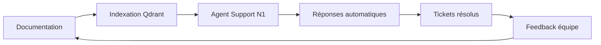

Voici une méthodologie structurée pour rassembler, organiser et intégrer ces informations, en phase avec les outils et l'architecture que vous avez définis.

## 2. Phase de collecte : méthodologie et outils


### 2.1. Audit documentaire et technique

| Objectif | Actions concrètes | Outils suggérés |
|----------|-------------------|-----------------|
| **Inventorier la documentation existante** | – Parcourir les dossiers partagés (Drive, réseau) <br> – Lister tous les documents (procédures, guides, comptes rendus) <br> – Identifier les formats et les dates | Google Drive, OneDrive, Explorateur Windows, arborescence |
| **Cartographier l’infrastructure Odoo** | – Relever la version Odoo, les modules installés <br> – Lister les bases de données (production, test) <br> – Noter les serveurs, adresses IP, fournisseurs d’hébergement | pgAdmin, Odoo interface, accès SSH |
| **Recenser les accès et identifiants** | – Récupérer tous les comptes de service, mots de passe, clés API <br> – Vérifier les droits des utilisateurs | Gestionnaire de mots de passe (Bitwarden, LastPass, KeePass) – **à mettre en place si inexistant** |
| **Lister les clients et projets** | – Exporter depuis le CRM ou l’ERP la liste des clients actifs <br> – Lister les projets en cours avec leurs statuts | Odoo CRM, tableur Excel/Google Sheets, outil de gestion de projet (Jira, Trello) |
| **Identifier les canaux de communication** | – Relever les groupes WhatsApp/Slack/Teams utilisés <br> – Noter les habitudes (fréquence, types d’échanges) | Observation, entretiens |

### 2.2. Entretiens et observations terrain

| Cible | Objectif | Questions clés |
|-------|----------|----------------|
| **Directeur Général** | Vision stratégique, priorités métier | Quels sont les 3 objectifs majeurs pour l’année ? Quelle place pour Odoo dans la stratégie ? |
| **Responsables métiers** (Achats, Compta, Stocks) | Comprendre les processus et les douleurs | Quelles sont les tâches répétitives ? Où perdez‑vous du temps ? Qu’aimeriez‑vous automatiser ? |
| **Équipe support** | Connaître les difficultés quotidiennes, les outils manquants | Quels sont les problèmes récurrents ? Comment documentez‑vous les solutions ? Avez‑vous une base de connaissances ? |
| **Développeurs (si existants)** | Connaître les projets en cours, les compétences | Quels sont les modules personnalisés ? Quelles intégrations existent ? |
| **Observation** | Voir le travail réel, les contournements | Passez une demi‑journée avec un agent support pour observer le traitement des tickets. |

### 2.3. Enquête écrite

Pour obtenir des informations standardisées de toute l’équipe, vous pouvez créer un formulaire simple :

- **Quels sont les 3 problèmes que vous rencontrez le plus souvent ?**
- **Quelles procédures aimeriez‑voir documentées ?**
- **Quels accès vous manquent ?**
- **Quelles suggestions d’amélioration ?**

Utilisez Google Forms ou un sondage simple.

---

## 3. Structuration et alimentation de la base de connaissances IA

Votre `GEMINI.md` définit une base de connaissances à trois niveaux :
- **GitHub** : documentation technique versionnée (markdown)
- **Google Drive** : fichiers binaires (PDF, rapports, contrats)
- **Qdrant** : indexation vectorielle pour la recherche sémantique
- **Redis** : cache des recherches fréquentes

### 3.1. Organisation des sources

#### GitHub
Créez un dépôt dédié `knowledge-base` avec une arborescence claire :

```
knowledge-base/
├── procedures/          # Procédures internes (markdown)
│   ├── offboarding.md
│   ├── backup.md
│   └── ...
├── guides/              # Guides utilisateurs (markdown)
│   ├── comment-creer-devis.md
│   └── ...
├── faq/                 # FAQ clients
├── tdr/                 # Termes de Référence / documents de projet
├── scripts/             # Scripts d’audit, d’automatisation
└── README.md
```

#### Google Drive
Structurez un répertoire partagé :

```
📁 ITS-Knowledge-Base
├── 📁 01_Rapports_Mensuels/
├── 📁 02_Contrats_Clients/
├── 📁 03_Formations/
├── 📁 04_Procédures_Qualité/
└── 📁 05_Archives_Projets/
```

### 3.2. Processus d’ingestion

Une fois les documents collectés et organisés, vous devez les indexer dans Qdrant pour que les agents puissent les interroger.

**Étapes** :

1. **Nettoyage** : Convertissez les documents texte (PDF, DOCX, etc.) en texte brut avec un outil comme `unstructured` (voir `GEMINI.md`).
2. **Découpage (chunking)** : Divisez les longs documents en morceaux cohérents (par titres, par sections).
3. **Génération d’embeddings** : Utilisez l’API Gemini (ou un modèle local avec Ollama) pour créer des vecteurs.
4. **Stockage dans Qdrant** : Insérez chaque morceau avec ses métadonnées (source, auteur, date, type).
5. **Mise en place de la synchronisation automatique** :
   - GitHub Actions pour déclencher une réindexation à chaque push.
   - Google Drive : utilisez un webhook ou un script périodique (n8n) pour détecter les modifications.

**Script d’indexation initial** : Vous pouvez écrire un script Python qui parcourt vos dossiers, extrait le texte, génère les embeddings et les pousse dans Qdrant. Inspirez-vous de l’exemple donné dans `GEMINI.md` (section `agents/utils/knowledge_base.py`).

### 3.3. Gestion des identifiants sensibles

Les mots de passe et clés API ne doivent **jamais** être stockés dans la base de connaissances accessible aux agents. Utilisez plutôt un gestionnaire de mots de passe (Bitwarden, Vaultwarden) et donnez aux agents la capacité de **suggérer** un accès sécurisé via un workflow de validation humaine.

Pour les besoins techniques (scripts automatisés), stockez les secrets dans des variables d’environnement ou un coffre sécurisé (HashiCorp Vault).

---

## 4. Prise de fonction et gestion de projet

Le document `OPERATIONS_DEFINITION.md` décrit déjà une **Phase 0 : Diagnostic Initial (Jours 1-15)**. Je vous propose de l’enrichir avec les actions concrètes suivantes, directement liées à la collecte d’informations pour la base de connaissances.

### 4.1. Semaine 1 – Immersion

- **Rencontres individuelles** (20-30 min) avec chaque membre de l’équipe pour comprendre son rôle, ses frustrations, ses souhaits.
- **Revue des tickets** des 6 derniers mois : identifiez les types de demandes, les délais, les récurrences.
- **Inventaire des accès** : dressez une liste de tous les systèmes (Odoo, serveurs, bases de données, outils tiers) et des personnes qui ont accès.
- **Mise en place du gestionnaire de mots de passe** (si inexistant) et import des identifiants.

### 4.2. Semaine 2 – Analyse documentaire

- **Collecte de toute la documentation existante** : classez‑la dans les dossiers GitHub/Drive.
- **Identification des lacunes** : notez ce qui manque (procédures non écrites, guides obsolètes).
- **Première réunion de service** : présentez vos objectifs, le projet d’agents IA, et demandez à chacun de contribuer à la base de connaissances (une petite tâche par semaine).

### 4.3. Semaine 3-4 – Indexation et premiers quick wins

- **Lancez l’indexation** des documents dans Qdrant.
- **Activez l’agent Support N1** sur un périmètre restreint (ex : FAQ) pour montrer la valeur.
- **Rédigez un rapport d’étape** pour la direction : ce que vous avez appris, les 3 priorités pour les 90 prochains jours.

### 4.4. Outils de gestion de projet

Pour suivre tout cela, utilisez un outil simple comme **Trello** ou **Notion** avec un tableau Kanban :

| À faire | En cours | Fait |
|--------|----------|------|
| Collecter les contrats clients | Entretien avec le responsable compta | Indexation des FAQ |

Vous pouvez aussi intégrer ce tableau avec vos agents via l’API.

---

## 5. Synthèse : ce que vous obtiendrez

À l’issue de cette phase, vous disposerez :

- D’une **cartographie complète** des systèmes, accès, équipes.
- D’une **base de connaissances structurée** (GitHub + Drive) prête à être interrogée par les agents IA.
- D’un **premier agent (Support N1)** opérationnel sur un sous‑ensemble.
- D’une **feuille de route** pour les prochains mois, alignée avec les attentes de la direction.

Tout cela vous permettra non seulement de bien prendre vos fonctions, mais aussi de démontrer rapidement votre valeur ajoutée.

---

## 🔍 Analyse de votre situation actuelle

| Élément | État actuel | Risque | Opportunité |
|--------|-------------|--------|-------------|
| **Équipe support** | 3 personnes, rôles non définis | Charge mal répartie, pas de spécialisation | Vous pouvez définir les rôles (N1, N2) dès maintenant |
| **Ticketing** | Odoo Helpdesk existant | Peut-être mal configuré | Données historiques exploitables |
| **Wiki / documentation** | Aucun | Connaissance uniquement dans les têtes | Vous allez créer la mémoire de l'entreprise |
| **CRM** | Pas vraiment | Visibilité client limitée | Opportunité de mettre en place Odoo CRM |
| **Identifiants techniques** | Non centralisés | Risque de perte, sécurité faible | Mettre en place un gestionnaire de mots de passe |
| **Communication** | WhatsApp interne et client | Mélange personnel/professionnel, pas traçable | Définir des règles claires |
| **Automatisation** | Aucune | Processus manuels chronophages | Vous pouvez partir sur une base saine |

---

## 🎯 Plan d'action adapté à votre contexte

### Phase 0 : Sécurisation et fondations (Semaine 1)

#### 🔐 1. Gestionnaire de mots de passe (URGENT)

Avant toute chose, sécurisez les accès existants.

**Action immédiate** :
```
1. Créer un compte Bitwarden (gratuit pour équipe) : https://bitwarden.com
2. Importer tous les membres de l'équipe (3 personnes)
3. Organisations par dossiers :
   - Serveurs
   - Odoo
   - Bases de données
   - Comptes clients
   - WhatsApp Business
4. Partager les dossiers selon les rôles
```

**Script de collecte** (à exécuter avec l'équipe) :
```bash
#!/bin/bash
# collect-credentials.sh
echo "🔐 Collecte des identifiants ITS"
echo "================================"
echo ""
echo "Veuillez noter TOUS les comptes que vous utilisez :"
echo "- Serveurs (SSH)"
echo "- Odoo (admin, utilisateurs)"
echo "- Bases de données"
echo "- Emails professionnels"
echo "- WhatsApp Business"
echo "- Comptes clients (admin)"
echo ""
read -p "Prêt à les saisir dans Bitwarden ? (oui/non) "
# Lancer Bitwarden en mode ajout
```

#### 📋 2. Audit rapide des tickets Odoo Helpdesk

```sql
-- Requête à exécuter dans Odoo pour analyser l'historique
SELECT 
    DATE(create_date) as date,
    team_id as equipe,
    COUNT(*) as nb_tickets,
    AVG(EXTRACT(EPOCH FROM (close_date - create_date))/3600) as duree_moyenne_heures
FROM helpdesk_ticket
WHERE create_date > NOW() - INTERVAL '6 months'
GROUP BY DATE(create_date), team_id
ORDER BY date DESC;
```

Exportez les résultats en CSV pour analyse dans Google Sheets.

#### 📞 3. Règles WhatsApp

Créez un document **URGENT** à partager avec l'équipe :

```markdown
# 📱 Règles d'utilisation WhatsApp chez ITS

## Groupes internes
- Un seul groupe "Équipe Support ITS"
- Pas de messages personnels
- Les informations importantes doivent être confirmées par email

## Groupes clients
- Un groupe par client PROJET (nom: ITS-[Client])
- Toujours répondre en message privé si info confidentielle
- Les demandes de support doivent être redirigées vers le Helpdesk
- **Règle d'or** : Toute solution trouvée sur WhatsApp doit être documentée

## Conservation
- Les discussions importantes seront exportées mensuellement
- Les exports seront stockés dans Google Drive
```

---

### Phase 1 : Construction de la mémoire d'entreprise (Semaines 2-4)

#### 📚 1. Création de la structure de documentation

**GitHub** (documentation technique) :
```bash
# Créer le dépôt
mkdir its-knowledge-base
cd its-knowledge-base
git init

# Structure initiale
mkdir -p {procedures,guides,faq,tdr,scripts,reunions}

# README.md
echo "# Base de Connaissances ITS" > README.md
echo "Documentation technique et procédures" >> README.md

# Premier commit
git add .
git commit -m "feat: structure initiale KB"
git remote add origin https://github.com/its/knowledge-base.git
git push -u origin main
```

**Google Drive** (fichiers et archives) :
```
📁 ITS - Documents
├── 📁 00_Administratif
│   ├── Contrats_employes/
│   └── Factures/
├── 📁 01_Clients
│   ├── ClientA/
│   │   ├── Contrat.pdf
│   │   ├── Projets/
│   │   └── Correspondances/
│   └── ClientB/
├── 📁 02_Projets_En_Cours
├── 📁 03_Archives_Tickets
│   └── Exports_WhatsApp/
└── 📁 04_Formations
```

#### 📝 2. Campagne de documentation participative

**Semaine 2** : Chaque membre documente une procédure

| Personne | Sujet | Format | Deadlin |
|----------|-------|--------|---------|
| Agent 1 | Comment traiter un ticket N1 | Markdown | Vendredi |
| Agent 2 | Les problèmes récurrents top 5 | Markdown | Vendredi |
| Agent 3 | Les clients difficiles et leurs spécificités | Markdown | Vendredi |

**Template de procédure** (`procedures/template.md`) :
```markdown
# [Titre de la procédure]

## Objectif
[Pourquoi cette procédure existe]

## Quand l'utiliser
[Dans quels cas appliquer cette procédure]

## Prérequis
- Accès nécessaire
- Outils requis

## Étapes
1. [Étape 1]
   - Détail
   - Capture d'écran (si utile)
2. [Étape 2]
   - ...

## Points d'attention
- [Pièges à éviter]

## Contacts utiles
- [Personne à contacter en cas de doute]
```

#### 📊 3. Mise en place d'un mini-CRM avec Odoo

Profitez que le CRM Odoo ne soit pas utilisé pour le configurer correctement :

```python
# Script d'import clients depuis WhatsApp/Excel
# À exécuter dans Odoo

import pandas as pd
from odoo import api, SUPERUSER_ID

def import_clients_from_whatsapp(env, csv_path):
    """Importe les clients depuis un export WhatsApp"""
    df = pd.read_csv(csv_path)
    
    for _, row in df.iterrows():
        partner = env['res.partner'].create({
            'name': row['nom'],
            'phone': row['telephone'],
            'email': row.get('email', ''),
            'customer_rank': 1,
        })
        
        # Ajouter une note avec l'historique
        partner.message_post(
            body=f"Client importé depuis WhatsApp le {datetime.now()}"
        )
    
    return len(df)
```

---

### Phase 2 : Alimentation de la base vectorielle (Semaines 3-4)

#### 🧠 1. Script d'indexation des connaissances

```python
# scripts/index_knowledge_base.py
import os
from pathlib import Path
from qdrant_client import QdrantClient
import google.generativeai as genai
from unstructured.partition.auto import partition
import hashlib
import json

class KnowledgeBaseIndexer:
    def __init__(self):
        self.qdrant = QdrantClient(
            url=os.getenv("QDRANT_URL", "http://localhost:6333")
        )
        genai.configure(api_key=os.getenv("GEMINI_API_KEY"))
        self.collection_name = "knowledge_base"
        
    def index_directory(self, base_path: str, source_type: str):
        """Indexe tous les fichiers d'un répertoire"""
        path = Path(base_path)
        
        for file_path in path.rglob('*'):
            if file_path.is_file() and not file_path.name.startswith('.'):
                self.index_file(file_path, source_type)
    
    def index_file(self, file_path: Path, source_type: str):
        """Indexe un fichier individuel"""
        print(f"📄 Indexation: {file_path}")
        
        try:
            # Extraire le texte
            elements = partition(filename=str(file_path))
            text = "\n".join([str(el) for el in elements])
            
            # Générer ID unique
            file_hash = hashlib.md5(
                f"{file_path}{os.path.getmtime(file_path)}".encode()
            ).hexdigest()
            
            # Générer embedding
            embedding = genai.embed_content(
                model="models/embedding-001",
                content=text[:5000],  # Limite pour l'API
                task_type="retrieval_document"
            )['embedding']
            
            # Stocker dans Qdrant
            self.qdrant.upsert(
                collection_name=self.collection_name,
                points=[{
                    'id': file_hash,
                    'vector': embedding,
                    'payload': {
                        'text': text[:10000],
                        'metadata': {
                            'source': source_type,
                            'file_name': file_path.name,
                            'path': str(file_path),
                            'type': file_path.suffix,
                            'size': file_path.stat().st_size,
                            'modified': file_path.stat().st_mtime
                        }
                    }
                }]
            )
            print(f"✅ Indexé: {file_path.name}")
            
        except Exception as e:
            print(f"❌ Erreur sur {file_path}: {e}")

# Exécution
indexer = KnowledgeBaseIndexer()
indexer.index_directory("/path/to/github/docs", "github")
indexer.index_directory("/path/to/google/drive/export", "google_drive")
```

#### 🔄 2. Automatisation avec n8n

Créez un workflow n8n qui :
1. Surveille un dossier Google Drive
2. À chaque nouveau fichier, déclenche l'indexation
3. Notifie l'équipe sur WhatsApp

```json
{
  "name": "Indexation automatique",
  "nodes": [
    {
      "name": "Google Drive Trigger",
      "type": "n8n-nodes-base.googleDriveTrigger",
      "parameters": {
        "folderId": "VOTRE_FOLDER_ID",
        "event": "fileAdded"
      }
    },
    {
      "name": "Python Function",
      "type": "n8n-nodes-base.pythonFunction",
      "parameters": {
        "functionCode": "import subprocess\nsubprocess.run(['python', 'index_file.py', items[0].json.fileId])\nreturn items"
      }
    },
    {
      "name": "WhatsApp Notification",
      "type": "n8n-nodes-base.whatsApp",
      "parameters": {
        "phone": "GROUPE_WHATSAPP_ID",
        "message": "Nouveau document indexé: {{$json.fileName}}"
      }
    }
  ]
}
```

---

### Phase 3 : Premier agent opérationnel (Semaine 5-6)

#### 🤖 1. Configuration de l'agent Support N1

```python
# agents/support_n1.py
class SupportN1Agent(BaseAgent):
    def __init__(self):
        super().__init__()
        self.kb = KnowledgeBase()
        
    async def process_ticket(self, ticket_data: dict):
        question = ticket_data['description']
        
        # 1. Chercher dans la base de connaissances
        docs = await self.kb.search(question, limit=3)
        
        if docs and docs[0]['score'] > 0.8:
            # Réponse basée sur la doc existante
            answer = await self.generate_answer(question, docs)
            return {
                'type': 'auto_answer',
                'answer': answer,
                'source': docs[0]['metadata']['file_name']
            }
        
        # 2. Si pas de réponse, suggérer une procédure
        return {
            'type': 'suggestion',
            'message': "Je n'ai pas trouvé de réponse automatique. Voici des documents similaires :",
            'suggestions': [d['metadata']['file_name'] for d in docs]
        }
```

#### 📱 2. Intégration WhatsApp

```python
# whatsapp_bot.py
from flask import Flask, request
from twilio.twiml.messaging_response import MessagingResponse

app = Flask(__name__)

# Mapping numéros WhatsApp -> clients
CLIENT_MAPPING = {
    '221771234567': 'client_alpha',
    '221777890123': 'client_beta',
}

@app.route('/whatsapp', methods=['POST'])
def whatsapp_webhook():
    msg = request.values.get('Body', '')
    sender = request.values.get('From', '')
    
    # Identifier le client
    client_id = CLIENT_MAPPING.get(sender, 'unknown')
    
    # Créer un ticket dans Odoo Helpdesk
    ticket_id = create_odoo_ticket(client_id, msg)
    
    # Chercher une réponse automatique
    agent = SupportN1Agent()
    result = await agent.process_ticket({
        'description': msg,
        'client_id': client_id
    })
    
    # Préparer la réponse
    response = MessagingResponse()
    
    if result['type'] == 'auto_answer':
        response.message(result['answer'])
    else:
        response.message(
            f"Votre demande a été enregistrée (ticket #{ticket_id}). "
            "Un agent va vous répondre dans les plus brefs délais."
        )
    
    return str(response)
```

---

## 📊 Indicateurs de progression

| Semaine | Objectif | Mesure |
|---------|----------|--------|
| 1 | Tous les identifiants dans Bitwarden | Audit du coffre |
| 2 | Structure GitHub créée + 3 procédures documentées | Nombre de fichiers dans GitHub |
| 3 | Indexation des documents existants | Nombre de vecteurs dans Qdrant |
| 4 | Premiers exports WhatsApp dans Drive | Nombre de conversations exportées |
| 5 | Agent Support N1 opérationnel | % de tickets résolus automatiquement |
| 6 | Intégration WhatsApp-Helpdesk | Délai de réponse moyen |

---

## 🔄 Cycle d'amélioration continue



**Chaque semaine** :
- Réunion de 30min avec l'équipe pour valider les nouvelles procédures
- Revue des tickets qui ont nécessité une escalade
- Mise à jour de la base de connaissances

**Chaque mois** :
- Rapport d'activité avec :
  - % de résolution automatique
  - Temps de réponse moyen
  - Documents ajoutés à la base
  - Suggestions d'amélioration

---

## ✅ Checklist pour les 7 prochains jours

- [ ] **Jour 1** : Créer compte Bitwarden et importer l'équipe
- [ ] **Jour 2** : Lister tous les comptes existants (avec l'équipe)
- [ ] **Jour 3** : Configurer la structure GitHub et Google Drive
- [ ] **Jour 4** : Exporter l'historique WhatsApp (demander à l'équipe)
- [ ] **Jour 5** : Lancer la première campagne de documentation
- [ ] **Jour 6** : Configurer l'accès à Qdrant (Docker local)
- [ ] **Jour 7** : Premier test d'indexation d'un document

---

## 💬 Message à l'équipe pour lancer la dynamique

```markdown
# 🚀 Bienvenue dans notre nouvelle organisation !

Bonjour à toutes et tous,

En tant que nouveau Responsable Support, j'ai besoin de votre aide pour construire quelque chose de solide ensemble.

## Pourquoi ?
Nous allons mettre en place des outils qui vont :
- ✅ Vous faciliter la vie (moins de répétitions)
- ✅ Améliorer notre service aux clients
- ✅ Faire gagner du temps à toute l'équipe

## Ce que je vous demande cette semaine
1. **Identifiants** : On va centraliser tous les accès dans Bitwarden (je vous envoie les invitations)
2. **WhatsApp** : Exportez vos conversations importantes avec les clients
3. **Une procédure** : Choisissez une tâche que vous faites souvent et écrivez les étapes (même simples)

## Ce que vous y gagnez
- Moins d'appels le soir/weekend (les clients trouveront leurs réponses)
- Une base de connaissance commune (plus besoin de chercher)
- Des outils qui vous aident vraiment

On commence demain par une réunion de 30min pour installer Bitwarden ensemble !

Merci pour votre aide 🙏
```

