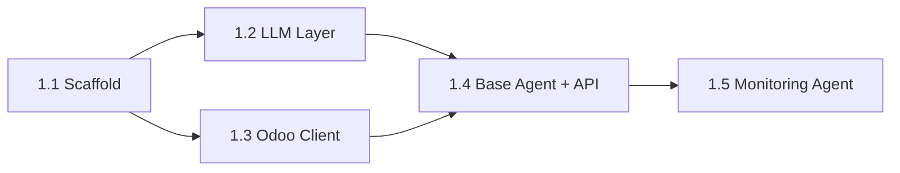

# Phase 1: Foundation Setup — Implementation Plan

> **Parent**: [task.md](file:///home/kamdemlens/.gemini/antigravity/brain/7251f1e7-d16c-49b6-ba55-c1a1af7b1dc7/task.md) → Phase 1  
> **Master Plan**: [synthese_projet_its.md](file:///home/kamdemlens/.gemini/antigravity/brain/7251f1e7-d16c-49b6-ba55-c1a1af7b1dc7/synthese_projet_its.md)  
> **Timeline**: Days 1-5 (Week 1)  
> **Goal**: Infrastructure + LLM layer + Odoo client + Base agent + Monitoring agent operational on 1 client

---

## User Review Required

> [!CAUTION]
> **Hardware constraint changes the LLM strategy significantly.**
>
> Your server specs: **Intel Celeron 4305U** (2 cores, 2 threads, 2.2GHz) + **16GB RAM** + **no GPU**.
>
> Ollama performance estimates on this hardware:
> | Model | RAM Usage | Speed (CPU-only, Celeron) | Verdict |
> |-------|-----------|---------------------------|---------|
> | Mistral 7B Q4 | ~4.5GB | ~0.5-1.5 tok/sec | ❌ Unusable (30s+ per response) |
> | Phi-3 mini 3.8B Q4 | ~2.5GB | ~2-4 tok/sec | ⚠️ Slow but usable for short queries |
> | Gemma 2B Q4 | ~1.5GB | ~4-6 tok/sec | ✅ Usable for classification/short tasks |
> | TinyLlama 1.1B Q4 | ~0.8GB | ~6-10 tok/sec | ✅ Fast but limited quality |
>
> **Revised LLM strategy:**
>
> - **Gemini Flash** (free tier) = **primary LLM** for all non-confidential tasks (fast, capable)
> - **Ollama Phi-3 mini** = **backup for confidential data** only (when query contains client names, credentials, financial data)
> - Smart routing in code decides which LLM to use based on data sensitivity markers

> [!IMPORTANT]
> **Question for you**: The Gemini Flash free tier currently allows ~15 requests/minute and ~1M tokens/day. Is this sufficient for your volume, or do we need to plan for paid Gemini usage? With 5+ clients and monitoring every 5 minutes, we'd use roughly 300 requests/day for monitoring alone.

---

## Proposed Changes

### 1.1 Project Scaffold & Infrastructure

Summary: Create the project root structure, Python package config, Docker services.

---

#### [NEW] [pyproject.toml](file:///home/kamdemlens/ITS/its-agents-system/pyproject.toml)

Python project configuration using `uv` package manager. Dependencies:

- `fastapi[standard]` — API framework
- `uvicorn` — ASGI server
- `pydantic` + `pydantic-settings` — Config & models
- `asyncpg` — PostgreSQL async driver
- `redis` — Redis client
- `httpx` — HTTP client (for Gemini API)
- `google-generativeai` — Gemini SDK
- `python-dotenv` — Environment vars
- `jinja2` — Template engine (for reports)
- `xmlrpc-client` — Odoo XML-RPC (stdlib)
- `apscheduler` — Task scheduling
- `python-telegram-bot` — Telegram alerting
- `paramiko` — SSH access for self-hosted Odoo
- `pytest` + `pytest-asyncio` — Testing

#### [NEW] [docker-compose.yml](file:///home/kamdemlens/ITS/its-agents-system/docker-compose.yml)

Services:

- `postgres` — PostgreSQL 15, port 5432, volume for persistence
- `redis` — Redis 7, port 6379
- `ollama` — Ollama container (CPU mode), port 11434, model pre-pull: `phi3:mini`

#### [NEW] [.env.example](file:///home/kamdemlens/ITS/its-agents-system/.env.example)

Template with: `GEMINI_API_KEY`, `DATABASE_URL`, `REDIS_URL`, `OLLAMA_URL`, `TELEGRAM_BOT_TOKEN`, `TELEGRAM_CHAT_ID`

#### [NEW] Directory structure

```
its-agents-system/
├── agents/
│   ├── __init__.py
│   ├── base.py
│   └── monitoring/
│       ├── __init__.py
│       ├── agent.py
│       ├── checks.py
│       └── alerting.py
├── api/
│   ├── __init__.py
│   ├── main.py
│   ├── routes/
│   │   ├── __init__.py
│   │   └── health.py
│   └── models/
│       ├── __init__.py
│       └── schemas.py
├── common/
│   ├── __init__.py
│   ├── config.py
│   ├── llm.py
│   ├── odoo_client.py
│   └── db.py
├── clients/
│   └── example_client.yml
├── tests/
│   ├── __init__.py
│   ├── unit/
│   │   ├── __init__.py
│   │   ├── test_llm.py
│   │   └── test_odoo_client.py
│   └── integration/
│       ├── __init__.py
│       └── test_monitoring.py
├── docker-compose.yml
├── pyproject.toml
├── .env.example
└── README.md
```

---

### 1.2 LLM Integration Layer

Summary: Smart LLM wrapper that routes between Gemini Flash and Ollama based on data sensitivity.

#### [NEW] [common/llm.py](file:///home/kamdemlens/ITS/its-agents-system/common/llm.py)

```python
# Core design: Strategy Pattern for LLM selection
#
# LLMRouter:
#   - classify_sensitivity(prompt) -> "public" | "confidential"
#   - route(prompt, sensitivity?) -> GeminiFlashProvider | OllamaProvider
#
# GeminiFlashProvider:
#   - generate(prompt, system_prompt?) -> str
#   - Uses google-generativeai SDK
#
# OllamaProvider:
#   - generate(prompt, system_prompt?) -> str
#   - Uses httpx to call Ollama REST API (localhost:11434)
#   - Model: phi3:mini (3.8B, fits in 2.5GB RAM)
#
# Sensitivity markers: client names, email addresses, financial amounts,
# database credentials → triggers Ollama routing
```

#### [NEW] [tests/unit/test_llm.py](file:///home/kamdemlens/ITS/its-agents-system/tests/unit/test_llm.py)

Tests:

- `test_sensitivity_classification_public` — Non-sensitive prompts → Gemini Flash
- `test_sensitivity_classification_confidential` — Prompts with client data → Ollama
- `test_gemini_provider_generate` — Mock Gemini API response
- `test_ollama_provider_generate` — Mock Ollama API response
- `test_router_fallback` — If Ollama is down, don't send confidential data to Gemini (error instead)

---

### 1.3 Odoo Client & Multi-tenant Foundation

Summary: Unified Odoo XML-RPC client supporting multiple client instances with per-client configuration.

#### [NEW] [common/odoo_client.py](file:///home/kamdemlens/ITS/its-agents-system/common/odoo_client.py)

```python
# OdooClient:
#   - __init__(client_config: ClientConfig)
#   - authenticate() -> uid
#   - search_read(model, domain, fields) -> list[dict]
#   - execute(model, method, *args) -> Any
#   - get_users() -> list[dict]      # For security agent
#   - get_groups() -> list[dict]     # For security agent
#   - ping() -> bool                  # For monitoring agent
#
# ClientConfig (from YAML):
#   - client_id, name, url, database, username, api_key
#   - hosting_type: "odoo_sh" | "self_hosted"
#   - ssh_host, ssh_user, ssh_key_path (if self_hosted)
#
# SelfHostedClient(OdooClient):
#   - Adds SSH access via paramiko for server-level checks (CPU, RAM, disk)
#
# OdooShClient(OdooClient):
#   - API-only access, no SSH
```

#### [NEW] [clients/example_client.yml](file:///home/kamdemlens/ITS/its-agents-system/clients/example_client.yml)

Template YAML for client configuration.

#### [NEW] [tests/unit/test_odoo_client.py](file:///home/kamdemlens/ITS/its-agents-system/tests/unit/test_odoo_client.py)

Tests:

- `test_client_config_loading` — Load YAML config correctly
- `test_authenticate_success` — Mock XML-RPC authentication
- `test_search_read` — Mock search_read call
- `test_ping_success` / `test_ping_failure`

---

### 1.4 Base Agent Framework + API Skeleton

Summary: Abstract agent class that all 5 agents inherit from. Minimal FastAPI app.

#### [NEW] [agents/base.py](file:///home/kamdemlens/ITS/its-agents-system/agents/base.py)

```python
# BaseAgent (ABC):
#   Properties: agent_id, name, agent_type, status, client_id
#   Methods:
#     - execute(task_input: dict) -> AgentResult      (abstract)
#     - health_check() -> bool                         (abstract)
#     - log(level, message)                            (concrete)
#     - get_llm(sensitivity) -> LLMProvider            (concrete, uses LLMRouter)
#     - get_odoo_client(client_id) -> OdooClient       (concrete)
#
# AgentResult:
#   - success: bool
#   - data: dict | None
#   - error: str | None
#   - execution_time_ms: int
```

#### [NEW] [api/main.py](file:///home/kamdemlens/ITS/its-agents-system/api/main.py)

FastAPI app with:

- `GET /health` — API health check
- `GET /api/agents/status` — List all agent statuses
- CORS middleware (for future dashboard)
- Lifespan event (startup: init DB pool, Redis, Ollama check)

#### [NEW] [common/config.py](file:///home/kamdemlens/ITS/its-agents-system/common/config.py)

Pydantic Settings class loading from `.env`:

- Database URL, Redis URL, Ollama URL
- Gemini API key
- Telegram bot token + chat ID
- Client config directory path

---

### 1.5 Agent Monitoring

Summary: First operational agent — monitors Odoo instances and server health, sends Telegram alerts.

#### [NEW] [agents/monitoring/agent.py](file:///home/kamdemlens/ITS/its-agents-system/agents/monitoring/agent.py)

```python
# MonitoringAgent(BaseAgent):
#   - execute(task_input) -> AgentResult
#     Runs all checks for a given client, returns aggregated health status
#   - run_all_checks(client_id) -> list[CheckResult]
#   - schedule_periodic(interval_minutes=5)
```

#### [NEW] [agents/monitoring/checks.py](file:///home/kamdemlens/ITS/its-agents-system/agents/monitoring/checks.py)

```python
# Individual check functions:
# - check_odoo_ping(odoo_client) -> CheckResult        # Is Odoo responding?
# - check_odoo_workers(odoo_client) -> CheckResult     # Overloaded workers?
# - check_server_cpu(ssh_client) -> CheckResult        # CPU usage (self-hosted only)
# - check_server_ram(ssh_client) -> CheckResult        # RAM usage (self-hosted only)
# - check_server_disk(ssh_client) -> CheckResult       # Disk space (self-hosted only)
# - check_database_size(ssh_client) -> CheckResult     # PostgreSQL DB size
#
# CheckResult:
#   - name: str, status: "ok"|"warning"|"critical", value: Any, threshold: Any
```

#### [NEW] [agents/monitoring/alerting.py](file:///home/kamdemlens/ITS/its-agents-system/agents/monitoring/alerting.py)

```python
# AlertManager:
#   - send_telegram(message: str) -> bool
#   - send_email(to, subject, body) -> bool   (optional, SMTP)
#   - alert_on_critical(check_results: list[CheckResult]) -> None
#     Filters critical results, sends formatted Telegram message
#   - cooldown logic: don't re-alert for same issue within 30 minutes
```

#### [NEW] [tests/integration/test_monitoring.py](file:///home/kamdemlens/ITS/its-agents-system/tests/integration/test_monitoring.py)

Integration test: spins up a mock Odoo-like HTTP server, runs monitoring checks, asserts results.

---

## Verification Plan

### Automated Tests

All tests run with:

```bash
# From project root
uv run pytest tests/ -v
```

| Test File                              | What It Covers                                          | Dependencies        |
| -------------------------------------- | ------------------------------------------------------- | ------------------- |
| `tests/unit/test_llm.py`               | LLM routing, sensitivity classification, provider mocks | None (all mocked)   |
| `tests/unit/test_odoo_client.py`       | Client config loading, XML-RPC mocks                    | None (all mocked)   |
| `tests/integration/test_monitoring.py` | End-to-end monitoring agent on mock server              | Docker (PostgreSQL) |

### Manual Verification

1. **Docker Compose health** — Run `docker compose up -d` and verify all 3 containers are healthy:

   ```bash
   docker compose ps
   # Expect: postgres (healthy), redis (healthy), ollama (running)
   ```

2. **Ollama model test** — Pull and test Phi-3 mini:

   ```bash
   docker exec ollama ollama pull phi3:mini
   docker exec ollama ollama run phi3:mini "Hello, respond in one sentence."
   # Expect: Response within 10-20 seconds (Celeron CPU)
   ```

3. **API smoke test** — Start FastAPI and hit health endpoint:

   ```bash
   uv run uvicorn api.main:app --reload
   curl http://localhost:8000/health
   # Expect: {"status": "ok", "agents": {...}}
   ```

4. **Monitoring agent test on real Odoo** — Configure 1 real client in `clients/`, run:
   ```bash
   uv run python -m agents.monitoring.agent --client=<client_id> --once
   # Expect: JSON output with check results (ping, workers)
   ```

---

## Implementation Order



Each sub-phase builds on the previous. The LLM layer and Odoo client can be built in parallel, both are needed before the base agent framework.
