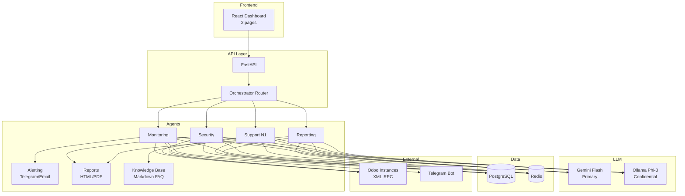

# Phase 3: Integration & Dashboard — Implementation Plan

> **Parent**: [task.md](file:///home/kamdemlens/.gemini/antigravity/brain/7251f1e7-d16c-49b6-ba55-c1a1af7b1dc7/task.md) → Phase 3  
> **Depends on**: [Phase 1](file:///home/kamdemlens/.gemini/antigravity/brain/7251f1e7-d16c-49b6-ba55-c1a1af7b1dc7/phase1_foundation.md), [Phase 2](file:///home/kamdemlens/.gemini/antigravity/brain/7251f1e7-d16c-49b6-ba55-c1a1af7b1dc7/phase2_core_agents.md)  
> **Timeline**: Days 11-15 (Week 3)  
> **Goal**: Reporting agent + orchestrator + minimal dashboard + demo-ready system

---

## Proposed Changes

### 3.1 Agent Reporting (Day 11)

Automated monthly report aggregating metrics from all agents.

#### [NEW] [agents/reporting/agent.py](file:///home/kamdemlens/ITS/its-agents-system/agents/reporting/agent.py)

```python
# ReportingAgent(BaseAgent):
#   - execute(task_input) -> AgentResult
#     Collects metrics, generates monthly report
#   - collect_metrics(client_id, period) -> ReportMetrics
#     - From monitoring: uptime %, alert count, incident count
#     - From security: findings count by severity, compliance score
#     - From support: tickets received/resolved, avg resolution time
#   - generate_report(metrics: ReportMetrics) -> ReportOutput
#     Jinja2 template → HTML (optionally PDF via weasyprint)
#   - generate_executive_summary(metrics) -> str
#     LLM (Gemini Flash) generates natural language summary
```

#### [NEW] [agents/reporting/templates/monthly_report.html](file:///home/kamdemlens/ITS/its-agents-system/agents/reporting/templates/monthly_report.html)

Styled HTML template matching OPERATIONS_DEFINITION.md monthly report format.

---

### 3.2 Orchestrateur Simple (Day 12)

Request routing — NO CrewAI. Simple FastAPI dispatcher.

#### [NEW] [api/routes/orchestrator.py](file:///home/kamdemlens/ITS/its-agents-system/api/routes/orchestrator.py)

```python
# POST /api/orchestrator/chat
# Body: {"message": "...", "client_id": "..."}
#
# Router logic (match/case):
#   - Keywords monitoring/uptime/serveur/CPU → MonitoringAgent
#   - Keywords sécurité/comptes/droits/audit → SecurityAgent
#   - Keywords ticket/aide/comment/problème → SupportAgent
#   - Keywords rapport/métriques/statistiques → ReportingAgent
#   - Fallback → LLM classification (Gemini Flash)
#
# Response: {"agent": "support", "response": "...", "confidence": 0.85}
```

#### [MODIFY] [api/main.py](file:///home/kamdemlens/ITS/its-agents-system/api/main.py)

Add orchestrator route, agent registry, conversation history (in-memory + Redis).

---

### 3.3 Dashboard Web Minimal (Days 13-14)

2-page React app for direction visibility.

#### [NEW] [web/](file:///home/kamdemlens/ITS/its-agents-system/web/) — React app (Vite)

```bash
npx -y create-vite@latest web -- --template react-ts
```

**Page 1 — Dashboard** (`/`):

- 4 MetricCards: Agents actifs, Tickets today, Uptime %, Alertes sécurité
- Activity bar chart (7 days) using recharts
- Recent tasks list

**Page 2 — System** (`/system`):

- Agent status cards (4 agents with status badges)
- Live logs feed (polling `/api/logs`)
- Last security audit summary

**Files**:

```
web/
├── src/
│   ├── App.tsx             # Router (react-router-dom)
│   ├── pages/
│   │   ├── Dashboard.tsx   # MetricCards + charts
│   │   └── System.tsx      # Agent status + logs
│   ├── components/
│   │   ├── MetricCard.tsx
│   │   ├── AgentStatusCard.tsx
│   │   ├── LogEntry.tsx
│   │   └── Sidebar.tsx
│   ├── hooks/
│   │   └── useApi.ts       # fetch wrapper
│   └── index.css           # Design system (CSS vars from GEMINI.md)
├── package.json
└── vite.config.ts          # Proxy /api → FastAPI
```

---

### 3.4 Demo Prep & Polish (Day 15)

#### End-to-end test script

```bash
# tests/e2e/test_full_flow.sh
# 1. Start all services (docker compose up)
# 2. Run monitoring agent → verify Telegram alert
# 3. Run security audit → verify report generated
# 4. Ask support question → verify AI response
# 5. Generate monthly report → verify HTML output
# 6. Hit dashboard → verify metrics displayed
```

#### Documentation

- [NEW] `README.md` — Setup instructions, architecture diagram, quickstart
- [NEW] `docs/demo_script.md` — Step-by-step demo for direction presentation

---

## Verification Plan

### Automated Tests

```bash
uv run pytest tests/ -v                  # Backend tests
cd web && npm run build                   # Frontend build check
```

### Manual Verification (Demo walkthrough)

1. **Start system**: `docker compose up -d && uv run uvicorn api.main:app`
2. **Dashboard**: Open `http://localhost:5173` → verify 4 MetricCards render
3. **Chat**: `POST /api/orchestrator/chat` with "Quel est l'état du monitoring?" → confirm routing to MonitoringAgent
4. **Security report**: Check `reports/` directory for latest HTML audit
5. **Telegram alert**: Trigger high CPU scenario → verify bot message received

---

## Architecture Summary (End of Week 3)


